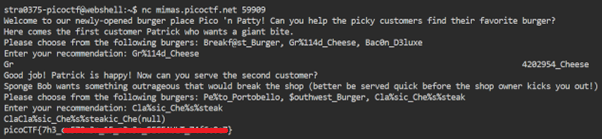
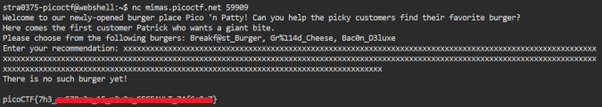

# format strings 0

**Platform:** picoCTF  
**Category:** Binary Exploitation                        
**Difficulty:** Easy  
**Tags:** `C` `buffer overflow` `segmentation fault`

---

## Challenge Description

**Author:** Cheng Zhang

**Description**

Can you use your knowledge of format strings to make the customers happy? Download the binary here. Download the source here.

Additional details will be available after launching your challenge instance.


```C
#include <stdio.h>
#include <stdlib.h>
#include <string.h>
#include <signal.h>
#include <unistd.h>
#include <sys/types.h>

#define BUFSIZE 32
#define FLAGSIZE 64

char flag[FLAGSIZE];

void sigsegv_handler(int sig) {
    printf("\n%s\n", flag);
    fflush(stdout);
    exit(1);
}

int on_menu(char *burger, char *menu[], int count) {
    for (int i = 0; i < count; i++) {
        if (strcmp(burger, menu[i]) == 0)
            return 1;
    }
    return 0;
}

void serve_patrick();

void serve_bob();


int main(int argc, char **argv){
    FILE *f = fopen("flag.txt", "r");
    if (f == NULL) {
        printf("%s %s", "Please create 'flag.txt' in this directory with your",
                        "own debugging flag.\n");
        exit(0);
    }

    fgets(flag, FLAGSIZE, f);
    signal(SIGSEGV, sigsegv_handler);

    gid_t gid = getegid();
    setresgid(gid, gid, gid);

    serve_patrick();
  
    return 0;
}

void serve_patrick() {
    printf("%s %s\n%s\n%s %s\n%s",
            "Welcome to our newly-opened burger place Pico 'n Patty!",
            "Can you help the picky customers find their favorite burger?",
            "Here comes the first customer Patrick who wants a giant bite.",
            "Please choose from the following burgers:",
            "Breakf@st_Burger, Gr%114d_Cheese, Bac0n_D3luxe",
            "Enter your recommendation: ");
    fflush(stdout);

    char choice1[BUFSIZE];
    scanf("%s", choice1);
    char *menu1[3] = {"Breakf@st_Burger", "Gr%114d_Cheese", "Bac0n_D3luxe"};
    if (!on_menu(choice1, menu1, 3)) {
        printf("%s", "There is no such burger yet!\n");
        fflush(stdout);
    } else {
        int count = printf(choice1);
        if (count > 2 * BUFSIZE) {
            serve_bob();
        } else {
            printf("%s\n%s\n",
                    "Patrick is still hungry!",
                    "Try to serve him something of larger size!");
            fflush(stdout);
        }
    }
}

void serve_bob() {
    printf("\n%s %s\n%s %s\n%s %s\n%s",
            "Good job! Patrick is happy!",
            "Now can you serve the second customer?",
            "Sponge Bob wants something outrageous that would break the shop",
            "(better be served quick before the shop owner kicks you out!)",
            "Please choose from the following burgers:",
            "Pe%to_Portobello, $outhwest_Burger, Cla%sic_Che%s%steak",
            "Enter your recommendation: ");
    fflush(stdout);

    char choice2[BUFSIZE];
    scanf("%s", choice2);
    char *menu2[3] = {"Pe%to_Portobello", "$outhwest_Burger", "Cla%sic_Che%s%steak"};
    if (!on_menu(choice2, menu2, 3)) {
        printf("%s", "There is no such burger yet!\n");
        fflush(stdout);
    } else {
        printf(choice2);
        fflush(stdout);
    }
}

```
---

## Reconnaissance

Examine the source code

**Key constants in the source code:**

```c
#define BUFSIZE  32
#define FLAGSIZE 64
```

**`sigsegv_handler(int sig)`** — prints the flag when a segmentation fault occurs.

> A **segmentation fault** is a runtime error triggered when a program tries to access memory it is not permitted to use — such as during a buffer overflow or an invalid pointer dereference.

**`serve_patrick()`** — Stage 1:
- Prints a menu and asks for a selection
- If item not on the menu is entered, the program will print “There is no such burger yet!”
- If the selected item causes **more than `2 × BUFSIZE` (64 bytes)** to be printed, it calls `serve_bob()`
- If the selected item causes less than `2 × BUFSIZE` (64 bytes) printed, it responds: `"Patrick is still hungry!"`

**`serve_bob()`** — Stage 2:
- Prints another menu and asks for a selection
- If item not on the menu is entered, the program will print “There is no such burger yet!”
- Otherwise, your input passes **directly into `printf()`** without a format string. This is the vulnerability!

---

## Solving the challenge

### 1. Feed Patrick (overflow the output size)

Use a **format string width specifier** to force the program to print more than 64 characters. In C, `%114d` instructs `printf` to print an integer with a minimum field width of 114 characters, padding with spaces:

```
Input: %114d
```

This prints the integer value of an internal variable padded to 114 characters — well over the 64-byte threshold. Patrick is satisfied and `serve_bob()` is called.

---

### 2. Crash Bob with a format string exploit

`serve_bob()` passes your input directly to `printf()`. Supply a string containing `%s` format specifiers:

```
Input: Cla%sic_Che%s%steak
```

`%s` is a format specifier in C, used as a placeholder for a string. When `printf()` processes `%s`, it expects a corresponding string argument on the stack. Because none was passed, it reads whatever happens to be at that stack location as a pointer and attempts to dereference it. This will either print garbage, `(null)`, or if the pointer is invalid, trigger a **segmentation fault**.

The `sigsegv_handler()` catches the segfault and prints the flag.



---

**Alternative — Buffer Overflow**

You can also trigger the segfault by entering a string long enough to overflow the buffer:

```
Input: xxxxxxxxxxxxxxxxxxxxxxxxxxxxxxxxxxxxxxxxxxxxxxxxxxxxxxxxxxxxxxxxxxxxxx
       (well over 64 characters)
```

The overflow corrupts the stack, causing a crash that triggers the signal handler.



---

## Flag

```
picoCTF{7h3_xxxxxxxx_xx_xxxxx_xxxxxxxx_xxxxxxxx}
```
*(Flag redacted)*

---

## Key takeaways

| # | Lesson |
|---|--------|
| 1 | ***Format string vulnerabilities** occur when user input is passed directly to `printf()` without a format string argument. Always use `printf("%s", input)`, never `printf(input)` |
| 2 | `%s` in a format string without a matching argument causes `printf` to read an **arbitrary stack value** as a pointer, leading to undefined behaviour or a crash |
| 3 | `%Nd` (e.g. `%114d`) forces `printf` to output at least N characters, which can be used to satisfy minimum-length checks |
| 4 | **Signal handlers** like `sigsegv_handler()` run automatically when a process receives a signal |
| 5 | Both format string exploits and buffer overflows can produce segmentation faults, giving multiple paths to the same goal |


---
*← [Back to Binary Exploitation](../../) | [Back to picoCTF](../../../)*
