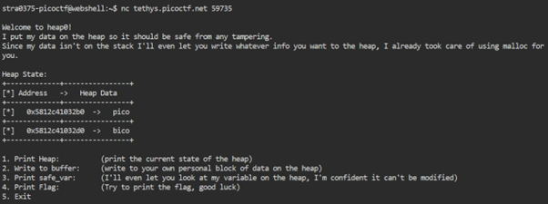
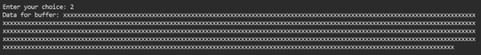
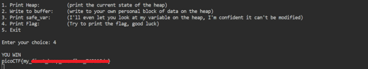

# heap 0

**Platform:** picoCTF  
**Category:** Binary Exploitation 
**Difficulty:** Easy  
**Tags:** `heap` `buffer overflow`

---

## Challenge Description

**Author:** Abrxs, pr1or1tyQ
Description
Are overflows just a stack concern? Download the binary here. Download the source here.

Additional details will be available after launching your challenge instance.


```C
#include <stdio.h>
#include <stdlib.h>
#include <signal.h>
#include <unistd.h>

void segfault_handler() {
  printf("Segfault Occurred, incorrect address.\n");
  exit(0);
}

int win() {
  FILE *fptr;
  char c;

  printf("You won!\n");
  // Open file
  fptr = fopen("flag.txt", "r");
  if (fptr == NULL)
  {
      printf("Cannot open file.\n");
      exit(0);
  }

  // Read contents from file
  c = fgetc(fptr);
  while (c != EOF)
  {
      printf ("%c", c);
      c = fgetc(fptr);
  }

  printf("\n");
  fclose(fptr);
}

int main() {
  signal(SIGSEGV, segfault_handler);
  setvbuf(stdout, NULL, _IONBF, 0); // _IONBF = Unbuffered

  printf("Address of main: %p\n", &main);

  unsigned long val;
  printf("Enter the address to jump to, ex => 0x12345: ");
  scanf("%lx", &val);
  printf("Your input: %lx\n", val);

  void (*foo)(void) = (void (*)())val;
  foo();
}
```
---

## Reconnaissance

When the program starts it prints the addresses of two heap-allocated variables — `pico` and `bico`.



The program presents 5 options and the goal is to overflow the `pico` buffer so it overwrites the `bico` variable.

---

## Solving the challenge

### 1. Calculate the distance between the two addresses

```
Address 1 (pico): 0x5812c41032b0
Address 2 (bio):  0x5812c41032d0
```

Since the prefixes are identical (`0x5812c41032`), only the last two hex digits differ:

```
0xd0 − 0xb0 = ?
```

Converting: `D = 13`, `B = 11`, so `13 − 11 = 2` → difference is `0x20`

> Note: Hex digits: 0, 1, 2, 3, 4, 5, 6, 7, 8, 9, A = 10, B = 11, C = 12, D = 13, E = 14, F = 15

Converting `0x20` to decimal: **32 bytes**

This tells us the heap allocator placed the two buffers **32 bytes apart**.

> **Note on hex subtraction (alternative method):**
> `0xd0 = 208` and `0xb0 = 176` in decimal → `208 − 176 = 32 bytes`

---

### 2. Select Option 2 (Write to pico)

Choose the option to write input into the `pico` buffer. Write **more than 32 bytes** to overflow past the buffer boundary and overwrite `bio`:

```
Enter input: xxxxxxxxxxxxxxxxxxxxxxxxxxxxxxxxxxxxxxxxxxxxxxxxxxxxxxxx
             (35+ characters — more than the 32-byte gap)
```

The overflow corrupts the `bico` variable in adjacent heap memory.




---

### 3. Select Option 4 (Get the Flag)

Select the option to print the flag. Because `bico` has been overwritten, the check that normally prevents this passes, and the flag is printed.



---

## Flag

```
picoCTF{my_xxxxx_xxxx_xxxxxxxx_xxxxxxxx}
```
*(Flag redacted)*

---

## Key takeaways

| # | Lesson |
|---|--------|
| 1 | The **heap** stores dynamically allocated memory and its size is determined at runtime |
| 2 | A **buffer overflow** occurs when more data is written to a fixed-size buffer than it was allocated to hold |
| 3 | Overflow excess overwrites **adjacent memory**, which can cause crashes, data corruption, unexpected behaviour, or exploitable security vulnerabilities |
| 4 | To find the distance between two hex addresses, subtract the differing hex digits and convert to decimal |
| 5 | Heap overflows can overwrite neighbouring variables, bypassing security checks that rely on those values |


---
*← [Back to Binary Exploitation](../../) | [Back to picoCTF](../../../)*
