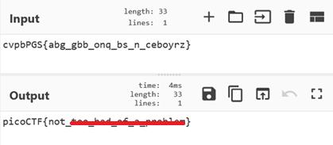

# 13

**Platform:** picoCTF  
**Category:** Cryptography 
**Difficulty:** Easy  
**Tags:** `ROT13` `cyberchef` 

---

## Challenge Description

**Author:** Alex Fulton/Daniel Tunitis

**Description**

Cryptography can be easy, do you know what ROT13 is? cvpbPGS{abg_gbb_onq_bs_n_ceboyrz}

---

## Solving the challenge

**ROT13** (rotate by 13) is one of the most common simple substitution ciphers in CTFs. 

**Steps:**
1. Copy the encoded string from the text file
2. Open [CyberChef](https://gchq.github.io/CyberChef/)
3. Apply the **"ROT13"** operation (rotation = 13)
4. The output is the flag



---

## Flag

```
picoCTF{not_xxx_xxx_xx_x_xxxxxxx}
```
*(Flag redacted)*

---

## Key takeaways

| # | Lesson |
|---|--------|
| 1 | **ROT13** shifts each letter by 13 positions — applying it twice returns the original, making it its own inverse |
| 2 | CyberChef makes ROT13 (and arbitrary ROT-N) fast to apply |


---
*← [Back to Cryptography](../../) | [Back to picoCTF](../../../)*
