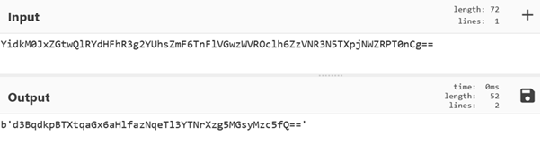
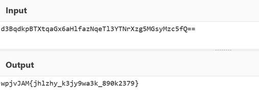
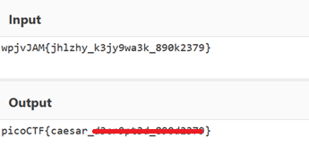

# interencdec

**Platform:** picoCTF  
**Category:** Cryptography                            
**Difficulty:** Easy  
**Tags:** `base64` `cyberchef` `decode`

---

## Challenge Description

**Author:** NGIRIMANA Schadrack

**Description**

Can you get the real meaning from this file. Download the file here. 

---

## Solving the challenge

The text file contains a sring of characters that appears to be in Base64 encoding.

### 1. Decode Base64 using Cyberchef
Use [CyberChef](https://gchq.github.io/CyberChef/) and apply the **"From Base64"** operation. This produces another encoded Base64 string.



---

### 2. Decode inner string using Cyberchef
Use [CyberChef](https://gchq.github.io/CyberChef/) and apply the **"From Base64"** operation. The result now looks structurally like a picoCTF flag but with shifted characters.



---

### 3. ROT cipher
Apply **"ROT13"** with a rotation of **19** in CyberChef to shift the characters back into place and reveal the flag.



---

## Flag

```
picoCTF{caesar_xxxxxxxxx_xxxxxxxx}
```
*(Flag redacted)*

---

## Key takeaways

| # | Lesson |
|---|--------|
| 1 | **Base64** is an encoding scheme (not encryption). It is easily reversible and often layered |
| 2 | Encoded data can be nested; always check the output of one decode for further encoding |
| 3 | CyberChef's **"Magic"** operation can auto-detect encoding layers |
| 4 | ROT ciphers are simple Caesar shifts — ROT19 forward is the same as ROT7 backward |


---
*← [Back to Cryptography](../../) | [Back to picoCTF](../../../)*
