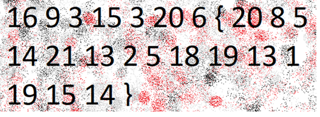

# The Numbers

**Platform:** picoCTF  
**Category:** Cryptography                                    
**Difficulty:** Easy  
**Tags:** `decode` `substitution cipher` `A1Z26 cipher` 

---

## Challenge Description

**Author:** Danny

**Description**

The numbers... what do they mean?
numbers.png

---

## Solving the challenge

Opening the PNG file displays a series of numbers appearing to be in the form picoCTF{flag}



**Steps:**
1. The numbers in the image correspond to their position in the alphabet (A=1, B=2, … Z=26). Decode each number manually:

| Number | Letter |
|--------|--------|
| 16 | p |
| 9 | i |
| 3 | c |
| 15 | o |
| 3 | C |
| 20 | T |
| 6 | f |
| { | { |
| 20 | t |
| 8 | h |
| 5 | e |
| 14 | n |
| 21 | u |
| 13 | m |
| 2 | b |
| 5 | e |
| 18 | r |
| 19 | s |
| 13 | m |
| 1 | a |
| 19 | s |
| 15 | o |
| 14 | n |
| } | } |

---

## Flag

```
picoCTF{thenumbersmason}
```
*(Flag redacted)*

---

## Key takeaways

| # | Lesson |
|---|--------|
| 1 | **A1Z26** (number-to-letter substitution) is one of the simplest ciphers |


---
*← [Back to Cryptography](../../) | [Back to picoCTF](../../../)*
