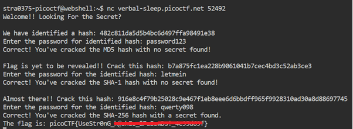

# hashcrack

**Platform:** picoCTF  
**Category:** Cryptography 
**Difficulty:** Easy  
**Tags:** `hash` `MD5` `SHA1` `SHA256`

---

## Challenge Description

**Author:** Nana Ama Atombo-Sackey

**Description**

A company stored a secret message on a server which got breached due to the admin using weakly hashed passwords. Can you gain access to the secret stored within the server?

Additional details will be available after launching your challenge instance.

---

## Solving the challenge

Several hashes are provided. Decrypt each one and enter the plaintext password to get the flag.

Hash cracking involves reversing a hashed value back to its original plaintext. Since these are likely common/weak passwords, tools like [CrackStation](https://crackstation.net/) or [hashes.com](https://hashes.com/en/decrypt/hash) can look them up instantly using precomputed rainbow tables.

**Steps:**
1. Copy each hash from the challenge
2. Paste it into CrackStation
3. Record the cracked plaintext for each hash
4. Enter the plaintexts as prompted to receive the flag

---



---

## Flag

```
picoCTF{useStr0nG_xxxxxx_xxxxxxxxx_xxxxxxxx}
```
*(Flag redacted)*

---

## Key takeaways

| # | Lesson |
|---|--------|
| 1 | **Hashing is one-way**. It cannot be mathematically reversed, but weak/common passwords can be found via rainbow tables |
| 2 | Tools like CrackStation maintain massive precomputed databases of hash→plaintext pairs |
| 3 | Strong, unique passwords resist rainbow table attacks; short or dictionary words do not |


---
*← [Back to Cryptography](../../) | [Back to picoCTF](../../../)*
