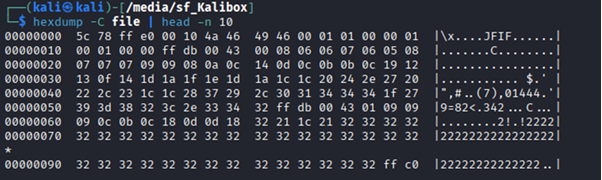
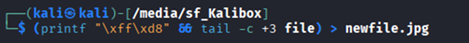

# Corrupted file

**Platform:** picoCTF  
**Category:** Forensics                                 
**Difficulty:** Easy  
**Tags:** `hexdump` `magic bytes`

---

## Challenge Description

**Author:** Yahaya Meddy

**Description**

This file seems broken... or is it? Maybe a couple of bytes could make all the difference. Can you figure out how to bring it back to life?

Download the file here.

---

## Reconnaissance

 The file has been corrupted and cannot be opened. We need to repair it to reveal the flag.

--- 

## Solving the challenge

### 1. Inspect the Header with hexdump

Use hexdump to display the header of the file:

```bash
hexdump -C file | head -n 10
```



--- 

### 2. Identify the Corruption

The file is in JFIF format, but the magic bytes at the start of the header are wrong:

| | Bytes |
|---|---|
| **Found** | `5c 78 ff` |
| **Expected (JPEG/JFIF)** | `ff d8 ff` |

> **Note:** **JFIF (JPEG File Interchange Format)** specifies how JPEG-compressed image data is stored, including resolution, aspect ratio, and colour space. **Magic bytes** in a file header are markers that identify its type. Missing or altered magic bytes cause files to be unreadable.

--- 

### 3. Fix the Magic Bytes

Because `hexdump` is read-only, use `printf` and `tail` to write a corrected copy:

```bash
(printf "\xff\xd8" && tail -c +3 file) > newfile.jpg
```

Breaking this command down:

| Part | Meaning |
|---|---|
| `parentheses ()` | run this as a single command |
| `printf "\xff\xd8"` | Outputs the correct first two bytes |
| `&&` | Only runs the next command if `printf` succeeded |
| `tail -c +3 file` | Outputs the original file starting from byte 3 (skipping the bad bytes) |
| `> newfile.jpg` | Redirects the combined output to a new file, preserving the original |



--- 

### 4. Open the Repaired File

Open `newfile.jpg` to view the flag.


--- 

## Flag

```
picoCTF{r3st0r1ng_xxx_xxxxx_xxxxxxxx}
```
*(Flag redacted)*

---

## Key takeaways

| # | Lesson |
|---|--------|
| 1 | `hexdump` lets you inspect the raw bytes of any file. Use `head` to focus on the header |
| 2 | Every file type has **magic bytes** that identify it. Corrupted or altered bytes prevent the file from being opened |
| 3 | `hexdump` is **read-only**, use `printf` and `tail` to patch bytes without overwriting the original |
| 4 | Even a single corrupted byte can render a file completely unusable |


---
*← [Back to Forensics](../../) | [Back to picoCTF](../../../)*
