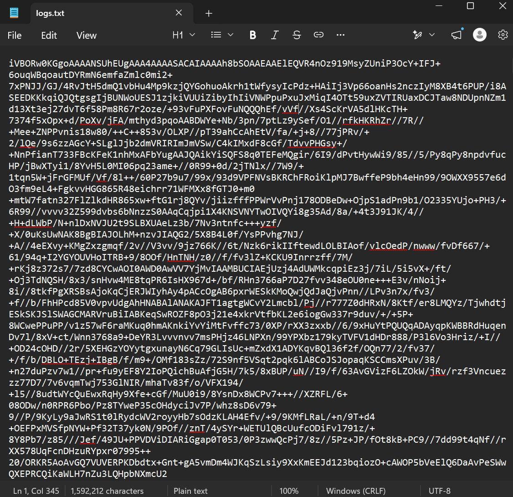
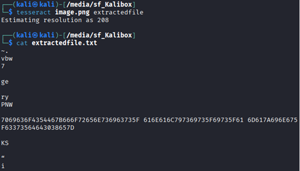
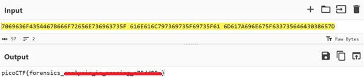

# Flag in Flame

**Platform:** picoCTF  
**Category:** Forensics 
**Difficulty:** Easy  
**Tags:** `tesseract` `Base64` `cyberchef`

---

## Challenge Description

**Author:** Prince Niyonshuti N.

**Description**

The SOC team discovered a suspiciously large log file after a recent breach. When they opened it, they found an enormous block of encoded text instead of typical logs. Could there be something hidden within? Your mission is to inspect the resulting file and reveal the real purpose of it. The team is relying on your skills to uncover any concealed information within this unusual log.

Download the encoded data here: Logs Data. Be prepared—the file is large, and examining it thoroughly is crucial .

---

## Reconnaissance

Downloading the text file and opening it shows a string of characters likely to be encoded in Base64.

--- 



--- 

## Solving the challenge

### 1. Decode Base64 to an Image

The contents of the file are a Base64-encoded image. Paste the text into [base64.guru](https://base64.guru/converter/decode/image) to reconstruct the image file (a `.png`).

This outputs the following image:


--- 

### 2. Extract Text from the Image with Tesseract

Notice a string of characters at the bottom of the image. Use [Tesseract OCR](https://github.com/tesseract-ocr/tesseract) to extract the string embedded in the image:

```bash
tesseract image.png extractedfile
```

--- 

### 3. Read the extracted text

Read the extracted string:

```bash
cat extractedfile.txt
```



--- 

### 4. Decode Hex in CyberChef

The output appears to be a hex-encoded string.. Paste the hex string into [CyberChef](https://gchq.github.io/CyberChef/) and apply the **From Hex** operation to reveal the flag.



--- 

## Flag

```
picoCTF{forensics_xxxxxxxx_xx_xxxxxxx_xxxxxxxx}
```
*(Flag redacted)*

---

## Key takeaways

| # | Lesson |
|---|--------|
| 1 | **Base64** is commonly used to conceal binary data. Images and files can be reconstructed from encoded text |
| 2 | **Tesseract** uses Optical Character Recognition (OCR) to extract text from image files |
| 3 | **Hex** frequently represents ASCII text |

## Additional

The following program could also be used to decode Base64 into an image:

```python
import base64

# Your Base64 string
base64_string = "replace with your actual image data=" 

# Specify the output file path and name
output_file_path = "output_image.png"

try:
    # Decode the Base64 string
    decoded_image_data = base64.b64decode(base64_string)

    # Write the decoded data to a file
    with open(output_file_path, "wb") as f:
        f.write(decoded_image_data)

    print(f"Image successfully generated and saved as '{output_file_path}'")

except base64.binascii.Error as e:
    print(f"Error decoding Base64 string: {e}")
except IOError as e:
    print(f"Error writing image file: {e}")
```


---
*← [Back to Forensics](../../) | [Back to picoCTF](../../../)*
