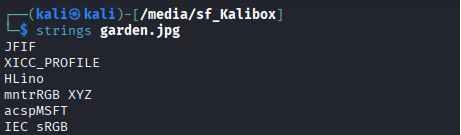
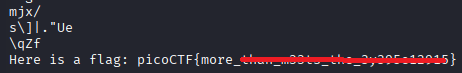
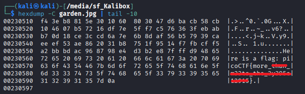

# Glory of the Garden

**Platform:** picoCTF  
**Category:** Forensics 
**Difficulty:** Easy  
**Tags:** `hexdump` `strings`

---

## Challenge Description

**Author:** jedavis/Danny

**Description**

This file contains more than it seems.

Get the flag from garden.jpg.

---

## Solving the challenge

### 1. Dump the Entire File with strings or hexdump

The flag is not in the metadata. Tt is appended to the raw file data. Dump everything:

```bash
strings garden.jpg
```





Or use `hexdump` to see the full contents including the end of the file:

```bash
hexdump -C garden.jpg | tail -30
```

Scroll through the output to find the flag string embedded after the standard JPEG data.



--- 

## Flag

```
picoCTF{more_xxxx_xxxxx_xxx_xxxxxxxxxxx}
```
*(Flag redacted)*

---

## Key takeaways

| # | Lesson |
|---|--------|
| 1 | Data can be **appended after the end of a valid file**. The image still opens normally, but extra content is hidden in the tail |
| 2 | `hexdump` with `tail` lets you inspect the end of a file where appended data is often found |
| 3 | `strings` is a quick way to surface any human-readable text embedded anywhere in a binary file |


---
*← [Back to Forensics](../../) | [Back to picoCTF](../../../)*
