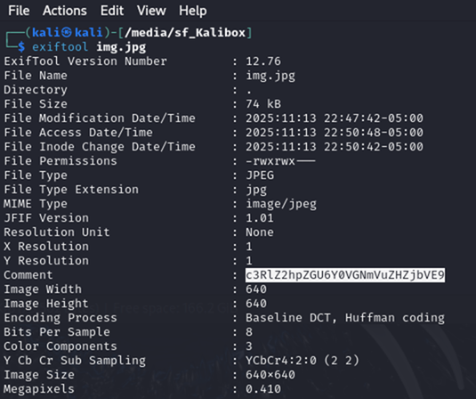
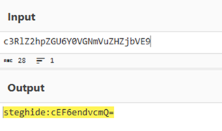
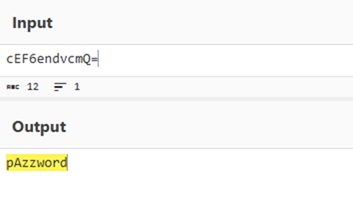
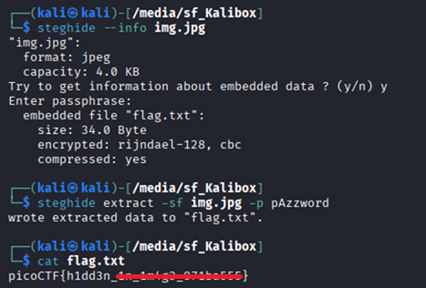

# Hidden in plainsight

**Platform:** picoCTF  
**Category:** Forensics 
**Difficulty:** Easy  
**Tags:** `exiftool` `Base64` `cyberchef` `steghide` 

---

## Challenge Description

**Author:** Yahaya Meddy

**Description**

You’re given a seemingly ordinary JPG image. Something is tucked away out of sight inside the file. Your task is to discover the hidden payload and extract the flag.

Download the jpg image here.

---

## Reconnaissance

Downloading the JPG and opening it shows an ordinary image with nothing visually suspicious. The flag must be concealed in either the file's metadata or embedded as hidden data within the file itself.

--- 


--- 

## Solving the challenge

### 1. Extract metadata with exiftool

Read the metadata using **exiftool** from the command line:

```bash
exiftool img.jpg
```

--- 

### 2. Find the Encoded String

The output contains a `Comment` field holding a Base64-encoded string.



--- 

### 3. Decode the String

Copy the Comment string and decode it from Base64 (e.g. using [CyberChef](https://gchq.github.io/CyberChef/) or a terminal):

```bash
echo "c3RlZ2hpZGU6Y0VGNmVuZHZjbVE9" | base64 --decode
```

The decoded output has two parts:

1. The word `steghide` — identifying the tool used to embed hidden data.
2. A second Base64-encoded string — the passphrase, also Base64-encoded.



--- 

### 4. Decode the passphrase (second layer)

Decode the second part with CyberChef **From Base64** again to reveal the passphrase "pAzzword".



--- 

### 5. Examine the file using steghide

[Steghide](https://www.kali.org/tools/steghide/) is a steganography tool that can hide and extract data inside JPG, BMP, WAV, and AU files. Install it on Kali Linux with:

```bash
sudo apt install steghide
```

Use steghide to display information about the file:

```bash
steghide -- info img.jpg
```

Enter the passphrase when prompted. The extracted information indicates an embedded file "flag.txt".




--- 

### 6. Extract hidden file using steghide

Use steghide to extract the hidden file using the recoved password:

```bash
steghide extract -sf img.jpg -p pAzzword
```

--- 


### 6. Read the text file

Read the contents of flag.txt:

```bash
cat flag.txt
```

---

## Flag

```
picoCTF{h1dd3n_xx_xxxxx_xxxxxxxx}
```
*(Flag redacted)*

---

## Key takeaways

| # | Lesson |
|---|--------|
| 1 | **Steganography** hides data inside ordinary-looking carrier files i.e. the image looks normal but contains an embedded secret payload |
| 2 | File metadata (EXIF comments, author fields, GPS tags) is a common place to hide hints or encoded data |
| 3 | Multi-layer encoding (Base64 → Base64 → steghide passphrase) is a common obfuscation pattern; always check whether decoded output is itself encoded |
| 4 | `exiftool` should be used whenever an image, audio, or video file is involved in a challenge |


---
*← [Back to Forensics](../../) | [Back to picoCTF](../../../)*
