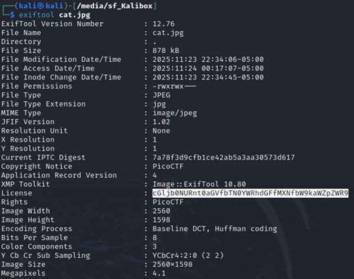
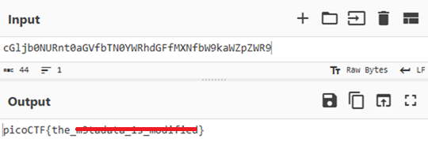

# Information

**Platform:** picoCTF  
**Category:** Forensics                      
**Difficulty:** Easy  
**Tags:** `exiftool` `Base64` `cyberchef`

---

## Challenge Description

**Author:** susie

**Description**

Files can always be changed in a secret way. Can you find the flag?

cat.jpg


---

## Reconnaissance

Download and ispect the metadata of the image file.

--- 

## Solving the challenge

### 1. Inspect Metadata using Exiftool

```bash
exiftool cat.jpg
```



--- 

### 2. Find the Encoded Field

The value of the **License** field appears to be a Base64-encoded string.

--- 

### 3. Decode the String

Paste the string into [CyberChef](https://gchq.github.io/CyberChef/) and apply **From Base64** to reveal the flag.



--- 

## Flag

```
picoCTF{the_xxxxxxxx_xx_xxxxxxxx}
```
*(Flag redacted)*

---

## Key takeaways

| # | Lesson |
|---|--------|
| 1 | File metadata (EXIF data) can contain sensitive or hidden information |
| 2 | `exiftool` reads metadata from a wide range of file types including images, PDFs, and audio files |


---
*← [Back to Forensics](../../) | [Back to picoCTF](../../../)*
