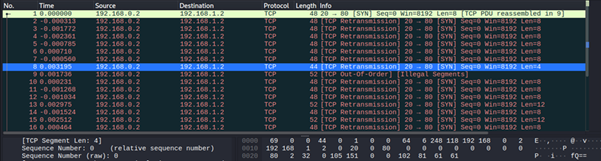
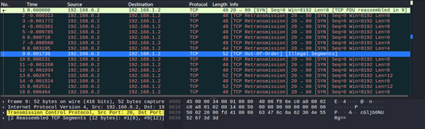
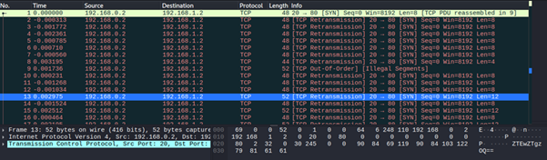
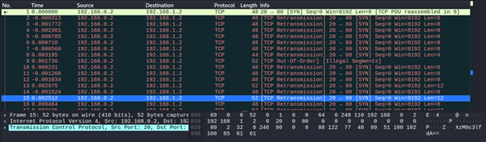
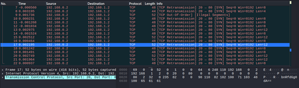
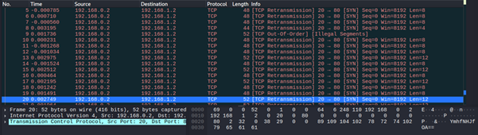
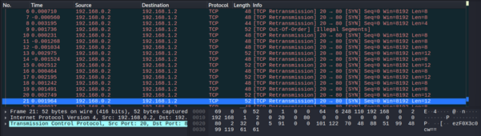

# Ph4nt0m 1ntrud3r

**Platform:** picoCTF  
**Category:** Forensics 
**Difficulty:** Easy  
**Tags:** `Wireshark` `Base64` 

---

## Challenge Description

**Author:** Prince Niyonshuti N.

**Description**

A digital ghost has breached my defenses, and my sensitive data has been stolen! 😱💻 Your mission is to uncover how this phantom intruder infiltrated my system and retrieve the hidden flag.

To solve this challenge, you'll need to analyze the provided PCAP file and track down the attack method. The attacker has cleverly concealed his moves in well timely manner. Dive into the network traffic, apply the right filters and show off your forensic prowess and unmask the digital intruder!

Find the PCAP file here Network Traffic PCAP file and try to get the flag.


---

## Reconnaissance

The PCAP file contains a Wireshark capture of network traffic. The flag is hidden in the fames of the trffic log.

--- 

## Solving the challenge

### 1. Open in Wireshark

Open the capture file in Wireshark. The traffic log contains 22 frames.

--- 

### 2. Inspect Raw Packet Data

Look at the raw packet data pane at the bottom of Wireshark. Some packets end with strings that appear to be Base64-encoded.















--- 

### 3. Collect All Base64 Fragments

| Base64 | Decoded |
|--------|---------|
| `fQ==` | `}` |
| `cGljb0NURg==` | `picoCTF` |
| `ZTEwZTgzOQ==` | `e10e839` |
| `XzM0c3lfdA==` | `_34sy_t` |
| `bnRfdGg0dA==` | `nt_th4t` |
| `YmhfNHJfOA==` | `bh_4r_8` |
| `ezF0X3c0cw==` | `{1t_w4s` |

---

### 4. Reassemble the Flag

Arrange the decoded fragments in order:

```
picoCTF{1t_w4snt_th4t_34sy_tbh_4r_8e10e839}
```

---

## Flag

```
picoCTF{1t_w4snt_th4t_34sy_tbh_4r_8e10e839
```
*(Flag redacted)*

---

## Key takeaways

| # | Lesson |
|---|--------|
| 1 | Always inspect **raw hex/ASCII bytes** in packet data, payloads are sometimes only visible there |
| 2 | Data can be **split across multiple packets** and must be manually reassembled |
| 3 | This challenge covers a core **network forensics** skill: extract, decode, and reconstruct hidden information from packet captures |


---
*← [Back to Forensics](../../) | [Back to picoCTF](../../../)*
