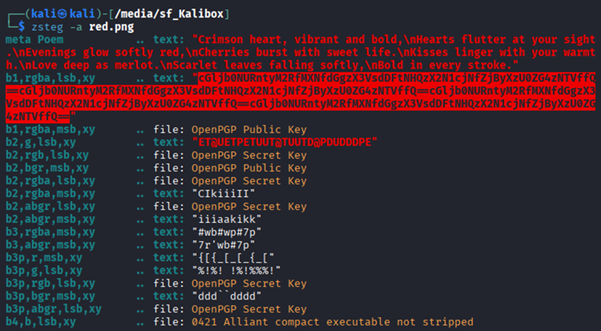
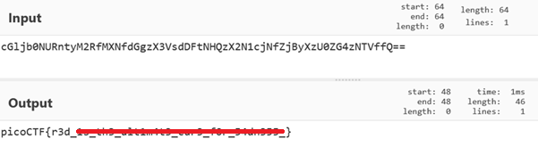

# RED

**Platform:** picoCTF  
**Category:** Forensics                         
**Difficulty:** Easy  
**Tags:** `zsteg` `Base64` `cyberchef`

---

## Challenge Description

**Author:** Shuailin Pan (LeConjuror)

**Description**

RED, RED, RED, RED

Download the image: red.png

---

## Reconnaissance

Downloading and opening the image file shows an image of a red square with no other visible content. The flag is hidden in this file. We cannot use steghide because it does not support ong files. However, zsteg is a tool that can be used to extract hidden data embedded in PNG and BMP image files.

--- 


--- 

## Solving the challenge

### 1. Run zsteg

```bash
zsteg -a red.png
```

In the output, there is a string that appears to be Base64-encoded.



--- 

### 2. Decode the Base64 String

Paste the highlighted string into [CyberChef](https://gchq.github.io/CyberChef/) and apply **From Base64** to reveal the flag.



--- 

## Flag

```
picoCTF{r3d_xx_xxx_xxxxxxxx_xxxx_xxx_xxxxxxx_}
```
*(Flag redacted)*

---

## Key takeaways

| # | Lesson |
|---|--------|
| 1 | **zsteg** detects and extracts hidden data from PNG and BMP image files.	It can detect hidden text, embedded files and modified pixel values that carry data embedded in image files |
| 2 | zsteg scans colour channels (R, G, B), the alpha (transparency) channel, and individual pixel bit-planes for hidden data |


---
*← [Back to Forensics](../../) | [Back to picoCTF](../../../)*
