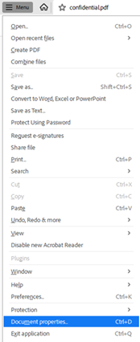
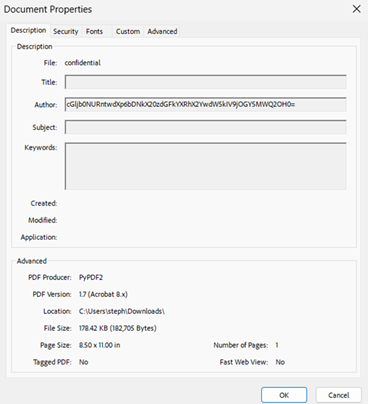
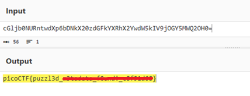
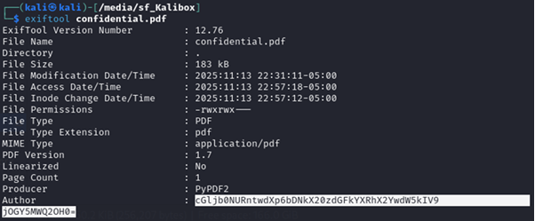

# Riddle Registry

**Platform:** picoCTF  
**Category:** Forensics 
**Difficulty:** Easy  
**Tags:** `metadata` `Base64` 

---

## Challenge Description

**Author:** Prince Niyonshuti N.

**Description**

Hi, intrepid investigator! 📄🔍 You've stumbled upon a peculiar PDF filled with what seems like nothing more than garbled nonsense. But beware! Not everything is as it appears. Amidst the chaos lies a hidden treasure—an elusive flag waiting to be uncovered.

Find the PDF file here Hidden Confidential Document and uncover the flag within the metadata.

---

## Solving the challenge
The flag is located in the metadata of a PDF file.

### 1. Open Document Properties

Open the PDF and navigate to **Menu → Document Properties** to access the file's metadata.



### 2. Find the Encoded String

Inside the metadata, locate the **Author** field. The value will appear to be a Base64-encoded string.



### 3. Decode the String

Copy the Author string and decode it from Base64 (e.g. using [CyberChef](https://gchq.github.io/CyberChef/) or a terminal):

```bash
echo "BASE64STRING" | base64 --decode
```

The decoded output is the flag.



**Alternative method: exiftool**

You can also read the metadata using **exiftool** from the command line:

```bash
exiftool confidential.pdf
```

---



---

## Flag

```
picoCTF{puzzl3d_xxxxxxxx_xxxxxx_xxxxxxxx}
```
*(Flag redacted)*

---

## Key takeaways

| # | Lesson |
|---|--------|
| 1 | Sensitive information is sometimes left in the **metadata** of files |
| 2 | `exiftool` is a fast CLI alternative to manually opening Document Properties |


---
*← [Back to Forensics](../../) | [Back to picoCTF](../../../)*
