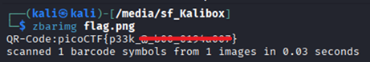

# Scan Surprise

**Platform:** picoCTF  
**Category:** Forensics                          
**Difficulty:** Easy  
**Tags:** `QR code` `zbar`

---

## Challenge Description

**Author:** Jeffery John

**Description**

I've gotten bored of handing out flags as text. Wouldn't it be cool if they were an image instead?

You can download the challenge files here:

    challenge.zip

Additional details will be available after launching your challenge instance.

---

## Reconnaissance

The downloaded file contains a QR code. 


There are two methods that can be used to solve this challenge:

1. Scan the QR code with your phone

2. Use **zbar** which is a command line tool that read barcodes

--- 

## Solving the challenge

### Method 1: Scan with Your Phon

Open your phone's camera or a QR scanner app and point it at the barcode. A link to the flag will be provided.

--- 

### Method 2: use zbar

Install the `zbar-tools` package if needed, then run:

```bash
zbarimg flag.png
```

The flag is printed directly to the terminal.



--- 

## Flag

```
picoCTF{p33k__x_xxx_xxxxxxxx}
```
*(Flag redacted)*

---

## Key takeaways

| # | Lesson |
|---|--------|
| 1 | **QR codes** encode arbitrary data — they are not limited to URLs |
| 2 | `zbar` scans and decodes barcodes and QR codes from image files via the command line |


---
*← [Back to Forensics](../../) | [Back to picoCTF](../../../)*
