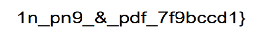
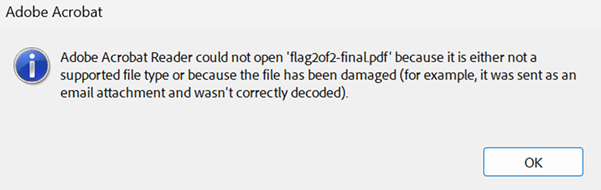
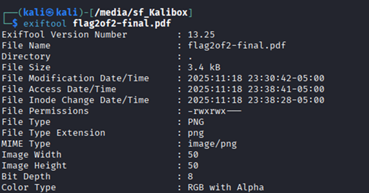
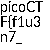

# Secret of the Polyglot

**Platform:** picoCTF  
**Category:** Forensics 
**Difficulty:** Easy  
**Tags:** `polyglot files` `exiftool`

---

## Challenge Description

**Author:** syreal

**Description**

The Network Operations Center (NOC) of your local institution picked up a suspicious file, they're getting conflicting information on what type of file it is. They've brought you in as an external expert to examine the file. Can you extract all the information from this strange file?

Download the suspicious file here.


---

## Reconnaissance

When you download the file, the browser opens it as a PDF. Scroll down to find the **second part** of the flag.



Opening the saved file in Adobe Acrobat Reader produces an error message



As the title of the challenge suggests this file is not a standard PDF. It alludes that the file is a polyglot file whcih means that the file is valid in two or more different formats. Therefore, the file behaves differently depending on which application opens it.

--- 

## Solving the challenge

### 1. Check Metadata with exiftool

```bash
exiftool flag2of2-final.pdf
```

The metadata reveals that the true file type is **PNG**.



--- 

### 2. Open as an Image

Rename the file to `.png` (or force-open it with an image viewer) to see the **first part** of the flag.

Combine both parts to form the complete flag.



--- 

## Flag

```
picoCTF{f1u3n7_xx_xxx_x_xxx_xxxxxxxx}
```
*(Flag redacted)*

---

## Key takeaways

| # | Lesson |
|---|--------|
| 1 | A **polyglot file** is simultaneously valid in two or more file formats |
| 2 | Different applications interpret the same file differently. A browser may render it as a PDF while an image viewer reveals a PNG |
| 3 | Polyglot files are used in attacks to bypass security checks. A file that looks like a harmless PDF may contain executable code when interpreted by a different application |


---
*← [Back to Forensics](../../) | [Back to picoCTF](../../../)*
