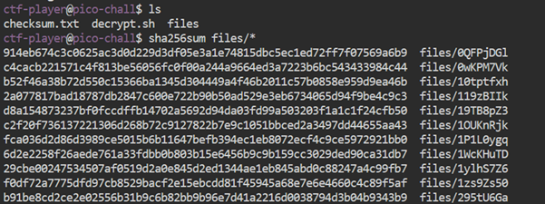
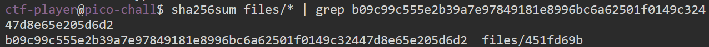
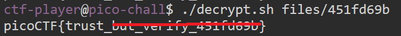

# Verify

**Platform:** picoCTF  
**Category:** Forensics 
**Difficulty:** Easy  
**Tags:** `checksum` `SHA256` `grep`

---

## Challenge Description

**Author:** Jeffery John

**Description**

People keep trying to trick my players with imitation flags. I want to make sure they get the real thing! I'm going to provide the SHA-256 hash and a decrypt script to help you know that my flags are legitimate.

Additional details will be available after launching your challenge instance.

---

## Reconnaissance

After connecting to the server via SSH using the provided username and password, run the `ls` command to display the contents of the directory. You will see three items: `checksum.txt`, `decrypt.sh`, and a `files/` directory.

Run the command `cat checksum.txt` to read the file which contains the SHA256 hash that you need to match.

Navigating into the files directory using the commands `cd files` and `ls` shows that the directory contains several different files.

The goal of the exercise is to compare the hashes of these files to the one provided in `checksum.txt`. The file that matches, contains the flag. The hint suggests, you can create a SHA checksum of individual files using the command: sha256sum <file> or you can do all the files in the directory using sha256sum <directory>/*

--- 

## Solving the challenge

### 1. Hash All Files

Generate checksums for every file in the `files/` directory using:

```bash
sha256sum files/*
```



--- 

### 2. Find the Matching File

Pipe the output into `grep` with the target hash:

```bash
sha256sum files/* | grep b09c99c555e2b39a7e97849181e8996bc6a62501f0149c32447d8e65e205d6d2
```

This identifies the specific file whose hash matches.



--- 

### 3. Decrypt and Get the Flag

Run the provided decryption script against the matched file to get the flag:

```bash
./decrypt.sh files/451fd69b
```



--- 

## Flag

```
picoCTF{trust_xxx_xxxxxx_xxxxxxxx}
```
*(Flag redacted)*

---

## Key takeaways

| # | Lesson |
|---|--------|
| 1 | **Checksums** verify that a file has not been altered. Even a single changed byte produces a completely different hash |
| 2 | `sha256sum <directory>/*` generates hashes for all files at once |
| 3 | Piping into `grep` lets you find an exact hash match across many files quickly |


---
*← [Back to Forensics](../../) | [Back to picoCTF](../../../)*
