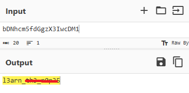

# Bases

**Platform:** picoCTF  
**Category:** General skills              
**Difficulty:** Easy  
**Tags:** `Base64`

---

## Challenge Description

**Author:** Sanjay C/Danny T

**Description**

What does this bDNhcm5fdGgzX3IwcDM1 mean? I think it has something to do with bases.

          
---

## Reconnaissance

The string provided is encoded in Base64. Decode it to find the flag.

--- 

## Solving the challenge

### 1. Decode it

Decode the string using an online convertor like cyberchef:




> **Alternative approach:**
Using the command line:

```bash
echo "<base64string>" | base64 -d
```

Or using Python:

```python
import base64
print(base64.b64decode("<base64string>").decode())
```

--- 

## Flag

```
picoCTF{l3arn_xxx_xxxxx}
```
*(Flag redacted)*

---

## Key takeaways

| # | Lesson |
|---|--------|
| 1 | Base64 is an *encoding*, not encryption — it provides no security and can be decoded instantly without a key |
| 2 | The `base64 -d` command on Linux decodes Base64 strings directly in the terminal |
| 4 | Python's `base64` module is a quick tool for decoding in a script: `base64.b64decode(s).decode()` |


---
*← [Back to General skills](../../) | [Back to picoCTF](../../../)*
