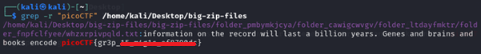

# Big Zip

**Platform:** picoCTF  
**Category:** General skills              
**Difficulty:** Easy  
**Tags:** `grep`

---

## Challenge Description

**Author:** LT 'syreal' Jones

**Description**

Unzip this archive and find the flag.

Download zip file
          
---

## Reconnaissance

Extract the zip file to find many files and subfolders. Instead of inspecting each of them manually, use the command **grep -r “picoCTF” /path/to/folder** to recursively search though all the files in all subfolders. The flag follows the standard `picoCTF{...}` format, which gives a reliable keyword to search for.

--- 

## Solving the challenge

### 1. Extract the zip file

```bash
unzip big-zip-files.zip
```
--- 

### 2. Recursively search all files for the flag keyword

```bash
grep -r "picoCTF" /home/kali/Desktop/big-zip-files
```

- `-r` tells `grep` to search **recursively** through all subdirectories
- `"picoCTF"` is the search keyword
- `/home/kali/Desktop/big-zip-files` is the actual path

`grep` will print the filename and the matching line containing the flag.



--- 

## Flag

```
picoCTF{gr3p_xx_xxxxx_xxxxxxxx}
```
*(Flag redacted)*

---

## Key takeaways

| # | Lesson |
|---|--------|
| 1 | `grep -r "<keyword>" <path>` is the go-to command for finding a specific string across an entire directory tree. This is essential when you have hundreds of files to search |
| 2 | In CTFs and real-world incident response, knowing what you're looking for (a flag format, a username, an IP) lets you skip manual inspection entirely |
| 3 | `grep` output includes the file path and matching line, immediately telling you both *where* the data lives and *what* it says |


---
*← [Back to General skills](../../) | [Back to picoCTF](../../../)*
