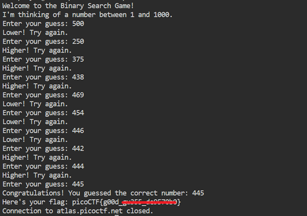

# Binary Search

**Platform:** picoCTF  
**Category:** Forensics 
**Difficulty:** Easy  
**Tags:** `binary search`

---

## Challenge Description

**Author:** Jeffery John

**Description**

Want to play a game? As you use more of the shell, you might be interested in how they work! Binary search is a classic algorithm used to quickly find an item in a sorted list. Can you find the flag? You'll have 1000 possibilities and only 10 guesses.

Cyber security often has a huge amount of data to look through - from logs, vulnerability reports, and forensics. Practicing the fundamentals manually might help you in the future when you have to write your own tools!

You can download the challenge files here:

    challenge.zip

```python
#!/bin/bash

# Generate a random number between 1 and 1000
target=$(( (RANDOM % 1000) + 1 ))

echo "Welcome to the Binary Search Game!"
echo "I'm thinking of a number between 1 and 1000."

# Trap signals to prevent exiting
trap 'echo "Exiting is not allowed."' INT
trap '' SIGQUIT
trap '' SIGTSTP

# Limit the player to 10 guesses
MAX_GUESSES=10
guess_count=0

while (( guess_count < MAX_GUESSES )); do
  read -p "Enter your guess: " guess

  if ! [[ "$guess" =~ ^[0-9]+$ ]]; then
    echo "Please enter a valid number."
    continue
  fi

  (( guess_count++ ))

  if (( guess < target )); then
    echo "Higher! Try again."
  elif (( guess > target )); then
    echo "Lower! Try again."
  else
    echo "Congratulations! You guessed the correct number: $target"

    # Retrieve the flag from the metadata file
    flag=$(cat /challenge/metadata.json | jq -r '.flag')
    echo "Here's your flag: $flag"
    exit 0  # Exit with success code
  fi
done

# Player has exceeded maximum guesses
echo "Sorry, you've exceeded the maximum number of guesses."
exit 1  # Exit with error code to close the connection
```
          
---

## Reconnaissance

Inspecting `guessing_game.sh` inside `challenge.zip` reveals the game's response logic:

- Guess **too low** → `"Higher! Try again."`
- Guess **too high** → `"Lower! Try again."`
- Guess **correct** → flag is printed

It is a guessing game that runs on a remote server. The target number is between 1 and 1000. Find it as efficiently as possible to get the flag.

--- 

## Solving the challenge

### 1. Apply binary search

Apply a **binary search**: always guess the midpoint of the current valid range, halving the remaining possibilities with each attempt.

| Guess # | Remaining possibilities |
|---------|------------------------|
| 1       | 1 000 → 500            |
| 2       | 500 → 250              |
| 3       | 250 → 125              |
| 4       | 125 → 63               |
| 5       | 63 → 32                |
| 6       | 32 → 16                |
| 7       | 16 → 8                 |
| 8       | 8 → 4                  |
| 9       | 4 → 2                  |
| 10      | 2 → **1** ✓            |

With a range of 1–1000, the correct number is guaranteed to be found within **10 guesses**.



--- 

## Flag

```
picoCTF{g00d_xxxxx_xxxxxxxx}
```
*(Flag redacted)*

---

## Key takeaways

| # | Lesson |
|---|--------|
| 1 | **Binary search** repeatedly halves the search space, giving O(log₂ n) time complexity. This is far more efficient than linear guessing |
| 2 | For n = 1000, log₂(1000) ≈ 10, so at most 10 guesses are needed regardless of where the target falls |
| 3 | Any system that gives "higher / lower" feedback is vulnerable to binary search enumeration; rate limiting or lockouts are the standard defence |
| 4 | Binary search is fundamental to computer science and appears in everything from database indexing to exploit development |


---
*← [Back to General skills](../../) | [Back to picoCTF](../../../)*
