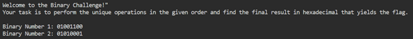
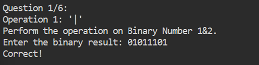
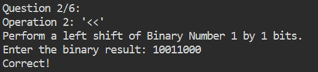
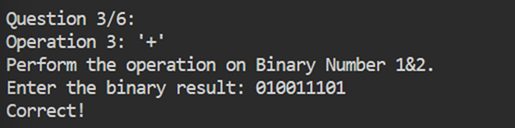
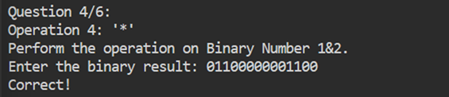
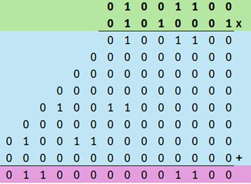
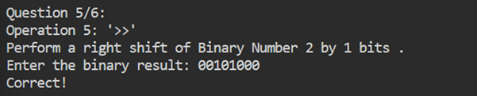
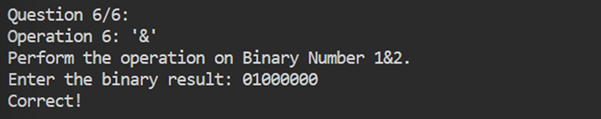
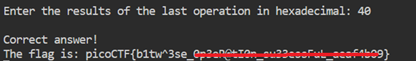

# binhexa

**Platform:** picoCTF  
**Category:** General skills              
**Difficulty:** Easy  
**Tags:** `bitwise operation` `binary`

---

## Challenge Description

**Author:** Nana Ama Atombo-Sackey

**Description**

How well can you perfom basic binary operations?

Additional details will be available after launching your challenge instance.
          
---

## Reconnaissance

The challenge provides two binary numbers:
- **Binary 1:** `01001100`
- **Binary 2:** `01010001`

Six operations must be performed in sequence, with the result of the final operation converted to hexadecimal for the flag.



--- 

## Solving the challenge

### 1. Bitwise OR (Binary 1 | Binary 2)



Bitwise OR outputs `1` if at least one of the bits is `1`:

| Rule | Result |
|------|--------|
| 1 \| 1 | 1 |
| 1 \| 0 | 1 |
| 0 \| 1 | 1 |
| 0 \| 0 | 0 |

```
  01001100
| 01010001
----------
  01011101
```

---

### 2. Left Shift Binary 1 by 1 bit



Each digit shifts one space to the left, and a `0` is appended to the right:

```
01001100  →  10011000
```

---

### 3. Add Binary 1 and Binary 2



Binary addition rules:
- `0 + 0 = 0`
- `0 + 1 = 1`
- `1 + 0 = 1`
- `1 + 1 = 0`, carry `1`
- `1 + 1 + 1 = 1`, carry `1`

```
  001001100
+ 001010001
-----------
  010011101
```

--- 

### 4. Multiply Binary 1 by Binary 2



Binary multiplication works like long multiplication in decimal. Each bit of the multiplier produces a shifted partial product, then all partial products are summed.

| Rule | Result |
|------|--------|
| 0 × 0 | 0 |
| 0 × 1 | 0 |
| 1 × 0 | 0 |
| 1 × 1 | 1 |



--- 

### 5. Right Shift Binary 2 by 1 bit



Each digit shifts one space to the right, and a `0` is prepended to the left:

```
01010001  →  00101000
```

--- 

### 6. Bitwise AND (Binary 1 & Binary 2)



Bitwise AND outputs `1` only if **both** bits are `1`:

| Rule | Result |
|------|--------|
| 1 & 1 | 1 |
| 1 & 0 | 0 |
| 0 & 1 | 0 |
| 0 & 0 | 0 |

```
  01001100
& 01010001
----------
  01000000
```

--- 

### 6. Convert the AND result to Hexadecimal



Convert the binary number of the last operation into a hexadecimal number to get the flag

Split `01000000` into two 4-bit nibbles:

```
0100  0000
```

Using the binary-to-hex lookup table:

| Binary | Hex |
|--------|-----|
| 0000 | 0 |
| 0001 | 1 |
| 0010 | 2 |
| 0011 | 3 |
| 0100 | 4 |
| 0101 | 5 |
| 0110 | 6 |
| 0111 | 7 |
| 1000 | 8 |
| 1001 | 9 |
| 1010 | A |
| 1011 | B |
| 1100 | C |
| 1101 | D |
| 1110 | E |
| 1111 | F |

`0100` = **4**, `0000` = **0** → result is **`40`**

--- 

## Flag

```
picoCTF{b1tw^3se_xxxxxxxxxx_xxxxxxxxxx_xxxxxxxx}
```
*(Flag redacted)*

---

## Key takeaways

| # | Lesson |
|---|--------|
| 1 | Bitwise OR (`\|`) returns `1` if either bit is `1`; AND (`&`) returns `1` only if both bits are `1` |
| 2 | Left-shifting by `n` bits is equivalent to multiplying by `2ⁿ`; right-shifting by `n` bits is equivalent to integer division by `2ⁿ` |
| 3 | Binary addition carries work identically to decimal addition, just with a base of 2 instead of 10 |
| 4 | Hexadecimal is a compact representation of binary. Every 4 bits maps to exactly one hex digit, making conversion straightforward with a lookup table |


---
*← [Back to General skills](../../) | [Back to picoCTF](../../../)*
