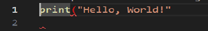
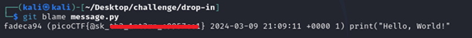

# Blame Game

**Platform:** picoCTF  
**Category:** General skills              
**Difficulty:** Easy  
**Tags:** `git`

---

## Challenge Description

**Author:** Jeffery John

**Description**

Someone's commits seems to be preventing the program from working. Who is it?

You can download the challenge files here:

    challenge.zip
          
---

## Reconnaissance

Inspecting `message.py` reveals a `print` statement with a missing closing bracket, causing a `SyntaxError`. The task is to identify which commit (and which author) introduced this line.



--- 

## Solving the challenge

### 1. Initialise the repository

```bash
git init
```

--- 

### 2. Run git blame

```bash
git blame message.py
```

`git blame` annotates every line of the file with:

- The **commit hash** that last modified it
- The **author name**
- The **date and time** of the change
- The **line content**

The line containing the broken `print` statement will be attributed to the author responsible.



--- 

## Flag

```
picoCTF{@sk_xxx_xxxxxx_xxxxxxxx}
```
*(Flag redacted)*

---

## Key takeaways

| # | Lesson |
|---|--------|
| 1 | `git blame <file>` traces every line of a file back to the exact commit and author that last modified it. This is invaluable for identifying when and by whom a bug or vulnerability was introduced |
| 2 | Git's audit trail is permanent; even if a developer tries to cover their tracks, the commit history records who did what and when |
| 3 | In real security work, `git blame` is used during incident response to pinpoint the commit that introduced a vulnerability, enabling faster patching and accountability |
| 4 | Combined with `git log` and `git show <hash>`, `git blame` gives a complete picture of the evolution of any file in a repository |


---
*← [Back to General skills](../../) | [Back to picoCTF](../../../)*
