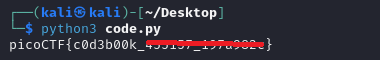

# Codebook

**Platform:** picoCTF  
**Category:** General skills              
**Difficulty:** Easy  
**Tags:** `python` 

---

## Challenge Description

**Author:** LT 'syreal' Jones

**Description**

Run the Python script code.py in the same directory as codebook.txt.

    Download code.py
    Download codebook.txt

          
---

## Reconnaissance

Two files are provided: a Python script and a textfile codebook.txt. Run the script (with the codebook in the same directory) to get the flag.

--- 

## Solving the challenge

### 1. Run the script

```bash
python3 code.py
```

The script reads the text file, performs its internal operations, and prints the flag.



--- 

## Flag

```
picoCTF{c0d3b00k_xxxxxx_xxxxxxxx}
```
*(Flag redacted)*

---

## Key takeaways

| # | Lesson |
|---|--------|
| 1 | Scripts that depend on external files will fail if those files are not in the expected location, always check file paths and working directories when a script errors unexpectedly |
| 2 | Codebook-based ciphers substitute symbols or characters according to a shared lookup table; without the codebook the cipher cannot be decoded |


---
*← [Back to General skills](../../) | [Back to picoCTF](../../../)*
