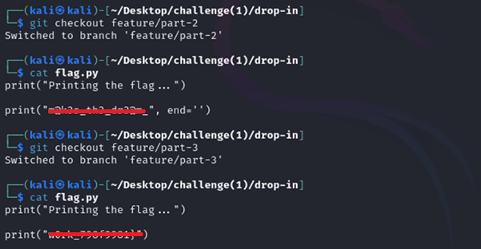
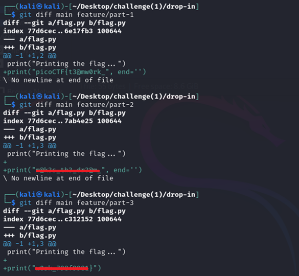

# Collaborative Development

**Platform:** picoCTF  
**Category:** General skills              
**Difficulty:** Easy  
**Tags:** `git`

---

## Challenge Description

**Author:** Jeffery John

**Description**

My team has been working very hard on new features for our flag printing program! I wonder how they'll work together?

You can download the challenge files here:

    challenge.zip
          
---

## Reconnaissance

Extracting `challenge.zip` shows a `.git` folder and a `flag.py`. The Python script designed to print the flag, but the flag string is incomplete in the current (`main`) branch. The Git repository has multiple branches. The flag is split across the feature branches. It needs to be reconstructed.

--- 

## Solving the challenge

### 1. Initialise and list all branches

```bash
git init
git branch -a
```

(-a includes remote branches)

Four branches are visible:

- `* main` — the current branch (incomplete flag)
- `feature/part-1`
- `feature/part-2`
- `feature/part-3`

Each feature branch likely holds one segment of the flag.

--- 

### 2. Inspect each feature branch

For each branch, switch to it, handle any overwrite warning, then read `flag.py`:

```bash
git checkout feature/part-1   # if error: git restore flag.py, then retry
cat flag.py                    # reveals part 1
```

Repeat for `feature/part-2` and `feature/part-3`.

**Alternative — diff against main**

```bash
git diff main feature/part-1
git diff main feature/part-2
git diff main feature/part-3
```

This shows only the lines that differ between each feature branch and `main`, isolating each flag segment without switching branches.

--- 

### 3. Concatenate the three parts

Combine the three segments in order to form the complete flag.

> Using
```bash
git checkout feature/part-1   # if error: git restore flag.py, then retry
cat flag.py                    # reveals part 1
```


> Using
```bash
git diff main feature/part-1
git diff main feature/part-2
git diff main feature/part-3                   # reveals part 1
```


--- 

## Flag

```
picoCTF{t3@mw0rk_xxxxx_xxx_xxxxx_xxxx_xxxxxxxx}
```
*(Flag redacted)*

---

## Key takeaways

| # | Lesson |
|---|--------|
| 1 | Git repositories can contain **multiple branches**, which are alternate timelines of the project, each with its own commits, files, and content |
| 2 | `git branch -a` lists all branches including remote-tracking ones; `-a` is essential since the default `git branch` only shows local branches |
| 3 | Developers sometimes create test or debug branches containing secrets, push them to a remote, and forget to delete them. Always audit branches before making a repository public |
| 4 | `git diff <branch1> <branch2>` is a fast way to surface differences between branches without switching the working directory |
| 5 | Sensitive data (passwords, API keys, debug flags) in any branch, not just `main` is exposed if the repository is made public |


---
*← [Back to General skills](../../) | [Back to picoCTF](../../../)*
