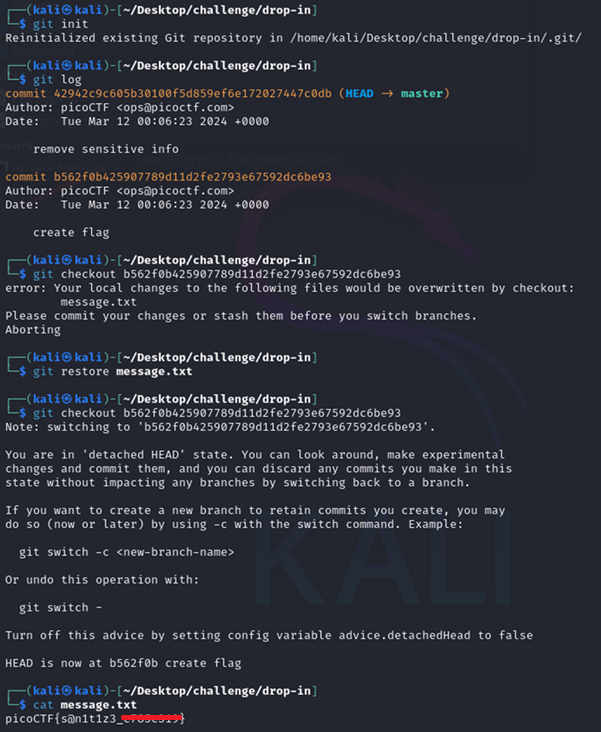

# Commitment Issues

**Platform:** picoCTF  
**Category:** General skills              
**Difficulty:** Easy  
**Tags:** `git`

---

## Challenge Description

**Author:** Jeffery John

**Description**

I accidentally wrote the flag down. Good thing I deleted it!

You download the challenge files here:

    challenge.zip
          
---

## Reconnaissance

Extracting `challenge.zip` reveals a `.git` folder alongside a `message.txt`. A file with the flag was committed and then deleted. Recover it. The `.git` folder contains the full commit history, including the state of the repository at the time the flag file existed.

--- 

## Solving the challenge

### 1. Initialise and inspect the history

```bash
git init
git log
```

`git log` shows two commits. The second commit has the message `"create flag"` . This is the commit that introduced the file containing the flag.

---

### 2. Attempt checkout

```bash
git checkout b562f0b425907789d11d2fe2793e67592dc6be93
```

Git may refuse and display an error warning that the checkout would overwrite uncommitted changes.

---

### 3. Discard current changes and retry

Since this is a CTF exercise, the current state of `message.txt` does not matter. Use the following command to restore message.txt:

```bash
git restore message.txt
```

Then attempt to checkout again using:

```bash
git checkout b562f0b425907789d11d2fe2793e67592dc6be93
```

---

### 4. Read the flag

```bash
cat message.txt
```

The file now contains the flag as it existed at the time of the `"create flag"` commit.



--- 

## Flag

```
picoCTF{s@n1t1z3_xxxxxxxx}
```
*(Flag redacted)*

---

## Key takeaways

| # | Lesson |
| 1 | The `.git` folder stores the **complete history** of a project. Deleted files are not truly gone; they can be recovered from earlier commits |
| 2 | `git log` lists all commits with their hashes and messages, making it easy to identify when a sensitive file was introduced |
| 3 | `git checkout <hash>` restores the entire working directory to the state of that commit; `git restore <file>` discards local changes to a single file |
| 4 | If a secret is accidentally committed, it must be **revoked and rotated** . Deleting it in a later commit does not remove it from history. Use `git filter-branch` or `git filter-repo` to purge it properly |
| 5 | `.git` folders should **never** be exposed on public web servers — an attacker can reconstruct the entire source tree from them |


---
*← [Back to General skills](../../) | [Back to picoCTF](../../../)*
