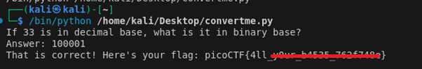

# convertme.py

**Platform:** picoCTF  
**Category:** General skills              
**Difficulty:** Easy  
**Tags:** `python`

---

## Challenge Description

**Author:** LT 'syreal' Jones

**Description**

Run the Python script and convert the given number from decimal to binary to get the flag.

Download Python script
          
---

## Reconnaissance


Running the downloaded script displays a decimal number. The task is to convert that number to binary representation.

```python
import random


def str_xor(secret, key):
    #extend key to secret length
    new_key = key
    i = 0
    while len(new_key) < len(secret):
        new_key = new_key + key[i]
        i = (i + 1) % len(key)        
    return "".join([chr(ord(secret_c) ^ ord(new_key_c)) for (secret_c,new_key_c) in zip(secret,new_key)])


flag_enc = chr(0x15) + chr(0x07) + chr(0x08) + chr(0x06) + chr(0x27) + chr(0x21) + chr(0x23) + chr(0x15) + chr(0x5f) + chr(0x05) + chr(0x08) + chr(0x2a) + chr(0x1c) + chr(0x5e) + chr(0x1e) + chr(0x1b) + chr(0x3b) + chr(0x17) + chr(0x51) + chr(0x5b) + chr(0x58) + chr(0x5c) + chr(0x3b) + chr(0x42) + chr(0x53) + chr(0x5c) + chr(0x0d) + chr(0x5e) + chr(0x50) + chr(0x4d) + chr(0x00) + chr(0x13)


num = random.choice(range(10,101))

print('If ' + str(num) + ' is in decimal base, what is it in binary base?')

ans = input('Answer: ')

try:
  ans_num = int(ans, base=2)
  
  if ans_num == num:
    flag = str_xor(flag_enc, 'enkidu')
    print('That is correct! Here\'s your flag: ' + flag)
  else:
    print(str(ans_num) + ' and ' + str(num) + ' are not equal.')
  
except ValueError:
  print('That isn\'t a binary number. Binary numbers contain only 1\'s and 0\'s')
```

--- 

## Solving the challenge

### 1. Run the script

```bash
python3 convertme.py
```

Note the decimal number displayed.

--- 

### 2. Convert decimal to binary
For example, if the number is `54`:

```
54 ÷ 2 = 27 remainder 0
27 ÷ 2 = 13 remainder 1
13 ÷ 2 =  6 remainder 1
 6 ÷ 2 =  3 remainder 0
 3 ÷ 2 =  1 remainder 1
 1 ÷ 2 =  0 remainder 1
```

Reading remainders from bottom to top: `110110`

Alternatively, use Python: `bin(54)` → `'0b110110'`

For 33: 

```
33 ÷ 2 = 16 remainder 1
16 ÷ 2 =  8 remainder 0
 8 ÷ 2 =  4 remainder 0
 4 ÷ 2 =  2 remainder 0
 2 ÷ 2 =  1 remainder 0
 1 ÷ 2 =  0 remainder 1
```



--- 

## Flag

```
picoCTF{4ll_xxxx_xxxxx_xxxxxxxx}
```
*(Flag redacted)*

---

## Key takeaways

| # | Lesson |
|---|--------|
| 1 | Decimal-to-binary conversion uses repeated division by 2. Collect remainders from bottom to top |
| 2 | Python's built-in `bin()` function converts any integer to its binary string representation instantly |


---
*← [Back to General skills](../../) | [Back to picoCTF](../../../)*
