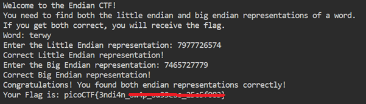

# endianness

**Platform:** picoCTF  
**Category:** General skills              
**Difficulty:** Easy  
**Tags:** `binary search`

---

## Challenge Description

**Author:** Nana Ama Atombo-Sackey

**Description**

Know of little and big endian?

Source

Additional details will be available after launching your challenge instance.


          
---

## Reconnaissance

Connect to a remote server using netcat. 
It will ask you to provide the big-endian and little-endian byte representations of a given string.

--- 

## Solving the challenge

### 1. Convert the string into its endian representation

Determine if a string is represented in little-endian or big-endian format. 

**Concept**

Endianness describes the order in which bytes of a multi-byte value are stored in memory:

- **Big endian** — most significant byte first (left to right, as written).
- **Little endian** — least significant byte first (right to left, bytes reversed).

**Method**

1. Look up (or calculate) the ASCII hex value for each character in the given string.
2. **Big endian:** write the hex bytes in the same left-to-right order as the string.
3. **Little endian:** write the hex bytes in reverse order.

**Example — the string `dcba`**

| Character | ASCII hex |
|-----------|-----------|
| d         | `64`      |
| c         | `63`      |
| b         | `62`      |
| a         | `61`      |

- Big endian:    `64 63 62 61`
- Little endian: `61 62 63 64`



--- 

## Flag

```
picoCTF{3ndi4n_xxxx_xxxxxxx_xxxxxxxx}
```
*(Flag redacted)*

---

## Key takeaways

| # | Lesson |
|---|--------|
| 1 | **Endianness** determines how a processor stores multi-byte values in memory. x86/x64 architectures use little endian; 
network protocols typically use big endian (network byte order) |
| 2 | A helpful analogy: in the number `2984`, changing the `4` changes the value by 1 (least significant), 
but changing the `2` changes it by 1000 (most significant). Endianness is about which end comes first in memory |
| 3 | When analysing binary files or network captures, bytes may appear reversed; 
recognising the endianness of the source system is essential to interpreting the data correctly |
| 4 | Reference: [GeeksforGeeks — Little and Big Endian Mystery](https://www.geeksforgeeks.org/dsa/little-and-big-endian-mystery/) |


---
*← [Back to General skills](../../) | [Back to picoCTF](../../../)*
