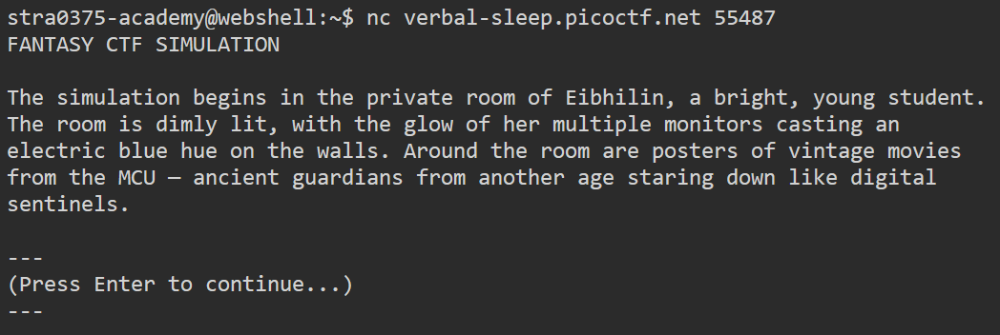
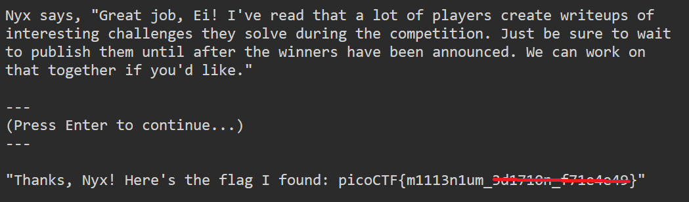

# FANTASY CTF

**Platform:** picoCTF  
**Category:** Forensics 
**Difficulty:** Easy  
**Tags:** `netcat`

---

## Challenge Description

**Author:** syreal

**Description**

Play this short game to get familiar with terminal applications and some of the most important rules in scope for picoCTF.

Additional details will be available after launching your challenge instance.

---

## Reconnaissance

The challenge provides a hostname (`verbal-sleep.picoctf.net`) and a port number (`55487`). No binary or source code is given — interaction with the server is the entire challenge.



--- 

## Solving the challenge

### 1. netcat

Use **netcat** to open a TCP connection to the remote server:

```bash
nc verbal-sleep.picoctf.net 55487
```

Follow the dialogue presented by the server. Responding to each prompt correctly leads to the flag being printed at the end of the conversation.



--- 

## Flag

```
picoCTF{m1113n1um_xxxxxxx_xxxxxxxx}
```
*(Flag redacted)*

---

## Key takeaways

| # | Lesson |
|---|--------|
| 1 | **Netcat (`nc`)** opens a raw TCP (or UDP) connection to a host and port, making it the standard tool for interacting with CTF services |
| 2 | The syntax `nc <host> <port>` is worth memorising |
| 3 | Once connected, the server controls the interaction; read prompts carefully as the correct response path is part of the puzzle |


---
*← [Back to General skills](../../) | [Back to picoCTF](../../../)*
