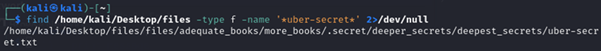
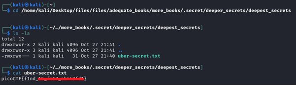
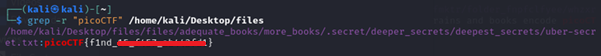

# Big Zip

**Platform:** picoCTF  
**Category:** General skills              
**Difficulty:** Easy  
**Tags:** `find` `regex` `grep` 

---

## Challenge Description

**Author:** LT 'syreal' Jones

**Description**

Unzip this archive and find the file named 'uber-secret.txt'

Download zip file
          
---

## Reconnaissance

After extracting the archive, the directory structure contains many folders. The goal is to locate `uber-secret.txt` without manually browsing every folder. This is a job for the `find` command. Note that using `grep -r "picoCTF" /path/to/folder` would also work.

--- 

## Solving the challenge

### 1. Extract the zip file

```bash
unzip files.zip
```
--- 

### Method 1: Use find
1. Search for the file by name

```bash
find /home/kali/Desktop/files -type f -name '*uber-secret*' 2>/dev/null
```

Breaking down the command:

| Component | Meaning |
|-----------|---------|
| `find` | Linux command to search for files and directories |
| `/home/kali/Desktop/files` | The root directory to search from  |
| `-type f` | Search for **files** only (`-type d` would search for directories) |
| `-name '*uber-secret*'` | Match any filename **containing** the text `uber-secret` (wildcards `*` allow partial matches) |
| `2>/dev/null` | Suppress error messages (e.g. "Permission denied") so only results are shown |



2. Read the file

Once `find` returns the full path, navigate to it and print the contents:

```bash
cd /home/kali/Desktop/files/files/adequate_books/more_books/.secret/deeper_secrets/deepest_secrets
cat uber-secret.txt
```


--- 

### 2. Recursively search all files for the flag keyword

```bash
grep -r "picoCTF" /home/kali/Desktop/files
```

- `-r` tells `grep` to search **recursively** through all subdirectories
- `"picoCTF"` is the search keyword
- `/home/kali/Desktop/files` is the actual path

`grep` will print the filename and the matching line containing the flag.



--- 

## Flag

```
picoCTF{f1nd_xx_xxxx_xxxxxxxx}
```
*(Flag redacted)*

---

## Key takeaways

| # | Lesson |
|---|--------|
| 1 | `find` is the standard Linux tool for locating files by name, type, size, or modification date. Use it whenever you know *what* you're looking for but not *where* |
| 2 | Wildcard matching with `*` lets you search for partial filenames, useful when you're unsure of the exact filename |
| 3 | Redirecting stderr to `/dev/null` (`2>/dev/null`) keeps output clean by hiding irrelevant permission errors |
| 4 | In real engagements, guessing plausible filenames (`passwords.txt`, `credentials`, `secret`) and using `find` to search for them is a valid reconnaissance technique |


---
*← [Back to General skills](../../) | [Back to picoCTF](../../../)*
