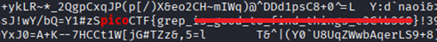

# First Grep

**Platform:** picoCTF  
**Category:** General skills              
**Difficulty:** Easy  
**Tags:** `grep`

---

## Challenge Description

**Author:** Alex Fulton/Danny Tunitis

**Description**

Can you find the flag in the file? This would be really tedious to look through manually, something tells me there is a better way.

The flag is in this file.

---

## Reconnaissance

A large text file is provided. Find the flag hidden somewhere inside it. The file is too large to read manually. The challenge is named after the `grep` command, which is a tool designed for searching text files.

--- 

## Solving the challenge

### Option 1. Open the file in a text editor**

Open the file and use `Ctrl + F` to search for `pico`. The flag will be highlighted.

### Option 2. Use grep on the command line**

```bash
grep -i 'pico' file.txt
```

The `-i` flag makes the search case-insensitive. The matching line which contains the flag is printed directly to the terminal.



--- 

## Flag

```
picoCTF{grep_xx_xxxx_xx_xxxx_xxxxxx_xxxxxxxx}
```
*(Flag redacted)*

---


## Key takeaways

| # | Lesson |
|---|--------|
| 1 | `grep <pattern> <file>` searches a file for lines matching a pattern and prints them |
| 2 | The `-i` flag makes `grep` case-insensitive, ensuring matches regardless of capitalisation |
| 3 | For very large files, `grep` is dramatically faster than manually scrolling |
| 4 | In real security work, `grep` is used to search logs, source code, and file systems for credentials, keys, and indicators of compromise |


---
*← [Back to General skills](../../) | [Back to picoCTF](../../../)*
