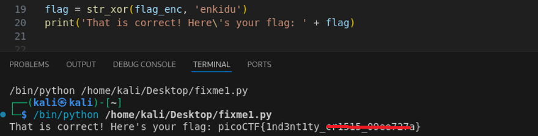

# fixme1.py

**Platform:** picoCTF  
**Category:** General skills              
**Difficulty:** Easy  
**Tags:** `python`

---

## Challenge Description

**Author:** LT 'syreal' Jones

**Description**

Fix the syntax error in this Python script to print the flag.

Download Python script
          
---

## Reconnaissance

Downloading and inspecting the source code reveals that the final `print` statement is incorrectly indented preventing the flag from being printed. Fix it and run the program to get the flag.

```python
import random


def str_xor(secret, key):
    #extend key to secret length
    new_key = key
    i = 0
    while len(new_key) < len(secret):
        new_key = new_key + key[i]
        i = (i + 1) % len(key)        
    return "".join([chr(ord(secret_c) ^ ord(new_key_c)) for (secret_c,new_key_c) in zip(secret,new_key)])


flag_enc = chr(0x15) + chr(0x07) + chr(0x08) + chr(0x06) + chr(0x27) + chr(0x21) + chr(0x23) + chr(0x15) + chr(0x5a) + chr(0x07) + chr(0x00) + chr(0x46) + chr(0x0b) + chr(0x1a) + chr(0x5a) + chr(0x1d) + chr(0x1d) + chr(0x2a) + chr(0x06) + chr(0x1c) + chr(0x5a) + chr(0x5c) + chr(0x55) + chr(0x40) + chr(0x3a) + chr(0x5e) + chr(0x52) + chr(0x0c) + chr(0x01) + chr(0x42) + chr(0x57) + chr(0x59) + chr(0x0a) + chr(0x14)

  
flag = str_xor(flag_enc, 'enkidu')
  print('That is correct! Here\'s your flag: ' + flag)
```

--- 

## Solving the challenge

### 1. Inspect the source code and fix the indentation

Remove the extra leading whitespace from the `print` line so it aligns with the left margin:

```python
# Before (broken):
    print(flag)

# After (fixed):
print(flag)
```

--- 

### 2. Run the fixed script

```bash
python3 fixme1.py
```



--- 

## Flag

```
picoCTF{1nd3nt1ty_xxxxxx_xxxxxxxx}
```
*(Flag redacted)*

---

## Key takeaways

| # | Lesson |
|---|--------|
| 1 | Python uses indentation to define code blocks. A misindented line changes the program's logic entirely, not just its appearance |
| 2 | Unlike many languages, Python has no `{}` braces; indentation *is* the syntax, so even a single extra space can change behaviour |
| 3 | Reading source code carefully and tracing the control flow is a core skill in both debugging and security analysis |


---
*← [Back to General skills](../../) | [Back to picoCTF](../../../)*
