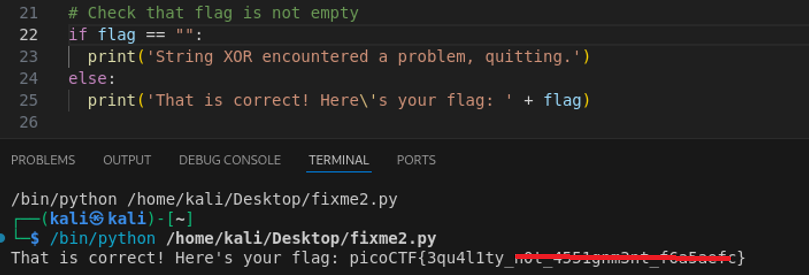

# fixme2.py

**Platform:** picoCTF  
**Category:** General skills              
**Difficulty:** Easy  
**Tags:** `python`

---

## Challenge Description

**Author:** LT 'syreal' Jones

**Description**

Fix the syntax error in this Python script to print the flag.

Download Python script
          
---

## Reconnaissance

Inspecting the source code reveals that an assignment operator (`=`) is used where a comparison operator (`==`) is needed. This prevents the flag from being evaluated and printed correctly. Fix it and run the program to get the flag.

```python
import random


def str_xor(secret, key):
    #extend key to secret length
    new_key = key
    i = 0
    while len(new_key) < len(secret):
        new_key = new_key + key[i]
        i = (i + 1) % len(key)        
    return "".join([chr(ord(secret_c) ^ ord(new_key_c)) for (secret_c,new_key_c) in zip(secret,new_key)])


flag_enc = chr(0x15) + chr(0x07) + chr(0x08) + chr(0x06) + chr(0x27) + chr(0x21) + chr(0x23) + chr(0x15) + chr(0x58) + chr(0x18) + chr(0x11) + chr(0x41) + chr(0x09) + chr(0x5f) + chr(0x1f) + chr(0x10) + chr(0x3b) + chr(0x1b) + chr(0x55) + chr(0x1a) + chr(0x34) + chr(0x5d) + chr(0x51) + chr(0x40) + chr(0x54) + chr(0x09) + chr(0x05) + chr(0x04) + chr(0x57) + chr(0x1b) + chr(0x11) + chr(0x31) + chr(0x0d) + chr(0x5f) + chr(0x05) + chr(0x40) + chr(0x04) + chr(0x0b) + chr(0x0d) + chr(0x0a) + chr(0x19)

  
flag = str_xor(flag_enc, 'enkidu')

# Check that flag is not empty
if flag = "":
  print('String XOR encountered a problem, quitting.')
else:
  print('That is correct! Here\'s your flag: ' + flag)
```

--- 

## Solving the challenge

### 1. Inspect the source code and fix the indentation

Find the line that checks whether the flag is non-empty. It incorrectly uses `=` (assignment) instead of `==` (equality comparison):

```python
# Before (broken):
if flag = "":
    print("String XOR encountered a problem, quitting.")

# After (fixed):
if flag == "":
    print("String XOR encountered a problem, quitting.")
```

--- 

### 2. Run the fixed script

```bash
python3 fixme2.py
```



--- 

## Flag

```
picoCTF{3qu4l1ty_xxx_xxxxxxxxxx_xxxxxxxx}
```
*(Flag redacted)*

---

## Key takeaways

| # | Lesson |
|---|--------|
| 1 | `=` assigns a value to a variable; `==` checks whether two values are equal |
| 2 | Python actually raises a `SyntaxError` if you try to use `=` inside an `if` condition, making this class of bug easy to catch |
| 3 | Carefully reading error messages and tracing them back to the offending line is an essential debugging habit |


---
*← [Back to General skills](../../) | [Back to picoCTF](../../../)*
