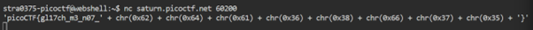

# Glitch Cat

**Platform:** picoCTF  
**Category:** General skills              
**Difficulty:** Easy  
**Tags:** `grep`

---

## Challenge Description

**Author:** LT 'syreal' Jones

**Description**

Our flag printing service has started glitching!

Additional details will be available after launching your challenge instance.
          
---

## Reconnaissance

Connecting to the server displays the first section of the flag followed by hex values. Convert the hex values to ASCII characters to get the remainder of the flag.



--- 

## Solving the challenge

### 1. Convert each hex value to ASCII

| Hex | ASCII |
|-----|-------|
| `0x62` | `b` |
| `0x64` | `d` |
| `0x61` | `a` |
| `0x36` | `6` |
| `0x38` | `8` |
| `0x66` | `f` |
| `0x37` | `7` |
| `0x35` | `5` |

--- 

### 2. Reconstruct the flag segment

Combining the decoded characters in order gives: **`bda68f75`**

Concatenate this into the flag template to complete the full flag.

--- 

## Flag

```
picoCTF{gl17ch_xx_xxx_xxxxxxxx}
```
*(Flag redacted)*

---

## Key takeaways

| # | Lesson |
|---|--------|
| 1 | Hex escape sequences (`0x##`) are simply numbers in base 16. Each byte maps directly to an ASCII character via a lookup table |
| 2 | Python's `chr(int('0x62', 16))` or `bytes.fromhex('62')` are quick ways to decode hex to ASCII programmatically |


---
*← [Back to General skills](../../) | [Back to picoCTF](../../../)*
