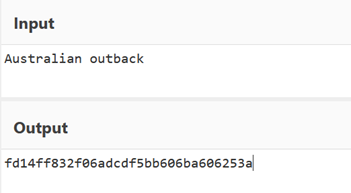
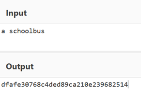
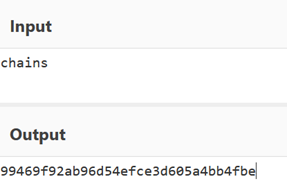
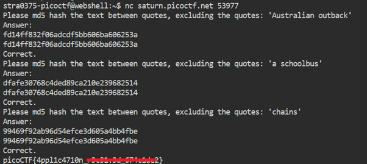
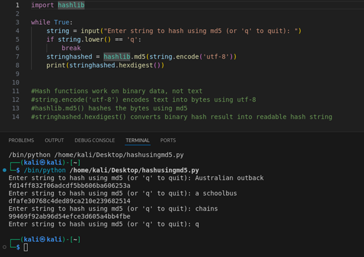

# HashingJobApp

**Platform:** picoCTF  
**Category:** General skills              
**Difficulty:** Easy  
**Tags:** `md5`

---

## Challenge Description

**Author:** LT 'syreal' Jones

**Description**

If you want to hash with the best, beat this test!

Additional details will be available after launching your challenge instance.
          
---

## Reconnaissance

Connecting to the remote server presents a series of strings and asks you to return the MD5 hash of each.

--- 

## Solving the challenge

### Method 1: CyberChef

1. Open [CyberChef](https://gchq.github.io/CyberChef/)
2. Paste the provided text
3. Apply the **"MD5"** operation
4. Copy the output hash and submit it to the instance






--- 

### Method 2: Python script (automated)

```python
import hashlib

while True:
    string = input("Enter string to hash using md5 (or 'q' to quit): ")
    if string.lower() == 'q':
        break
    stringhashed = hashlib.md5(string.encode('utf-8'))
    print(stringhashed.hexdigest())
```

- Hash functions work on binary data, not text
- `string.encode('utf-8')` encodes text into bytes using utf-8
- `hashlib.md5()` hashes the bytes using md5
- `stringhashed.hexdigest()` converts binary hash result into readable hash string



--- 

## Flag

```
picoCTF{4ppl1c4710n_xxxxxxxx_xxxxxxxx}
```
*(Flag redacted)*

---

## Key takeaways

| # | Lesson |
|---|--------|
| 1 | MD5 is a one-way hash function, it converts input into a fixed 128-bit (32 hex character) digest that cannot be reversed |
| 2 | MD5 is considered cryptographically broken for security-sensitive uses (collision attacks exist) |
| 3 | Python's `hashlib` library makes computing MD5, SHA-1, SHA-256, and other hashes trivial with a single line of code |


---
*← [Back to General skills](../../) | [Back to picoCTF](../../../)*
