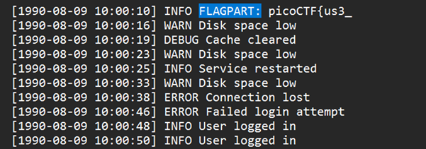
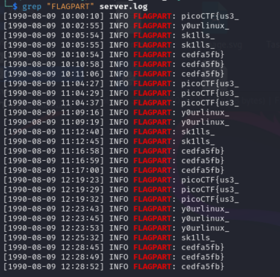

# Log Hunt

**Platform:** picoCTF  
**Category:** Forensics 
**Difficulty:** Easy  
**Tags:** `log` `grep`

---

## Challenge Description

**Author:** Yahaya Meddy

**Description**

Our server seems to be leaking pieces of a secret flag in its logs. The parts are scattered and sometimes repeated. Can you reconstruct the original flag?

Download the logs and figure out the full flag from the fragments.

---

## Reconnaissance

Downloading and opening the document reveals a large text log file. The flag is split into parts hidden within it. Sections of the flag are located after the keyword FLAGPART. To solve the challenge you can either manually search for "FLAGPART" and reassembling each section or you can use grep.



--- 

## Solving the challenge

### 1. grep

```bash
grep "FLAGPART" server.log
```

This prints every line containing `FLAGPART`, isolating all flag segments at once. Read them in order and join them to reconstruct the full flag.



--- 

## Flag

```
picoCTF{us3_xxxxxxxxx_xxxxxx_xxxxxxxx}
```
*(Flag redacted)*

---

## Key takeaways

| # | Lesson |
|---|--------|
| 1 | **Log analysis** is a core security skill. Logs record login/logout events, backups, cron jobs, network connections, privilege escalation, failed login attempts, and repeated access to sensitive URLs |
| 2 | `grep` is the fastest way to search large log files for a specific keyword or pattern without reading every line |
| 3 | Recognising patterns across log entries can reveal intrusions or system misuse. Anomalies like repeated failed logins or unusual root-level commands are red flags |
| 4 | In real incident response, `grep`, `awk`, and `cut` are used together to parse, filter, and extract fields from log files at scale |


---
*← [Back to General skills](../../) | [Back to picoCTF](../../../)*
