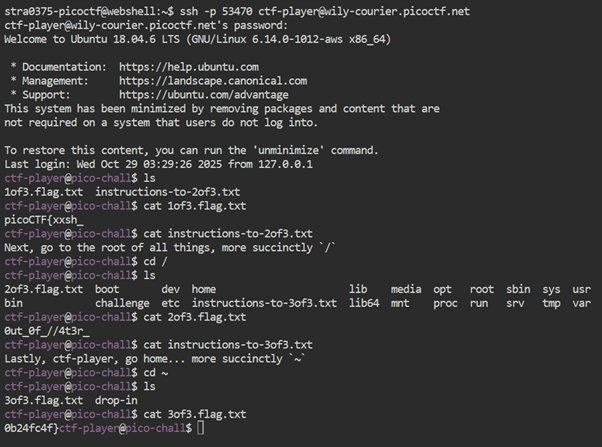

# Magikarp Ground Mission

**Platform:** picoCTF  
**Category:** General skills              
**Difficulty:** Easy  
**Tags:** `linux`

---

## Challenge Description

**Author:** syreal

**Description**

Do you know how to move between directories and read files in the shell? Start the container, ssh to it, and then ls once connected to begin.

Additional details will be available after launching your challenge instance.
          
---

## Reconnaissance

Connect to the remote server via SSH and navigate through the filesystem, collecting three parts of the flag scattered across different directories.

--- 

## Solving the challenge

### 1. Connect via SSH

```bash
ssh -p 53470 ctf-player@wily-courier.picoctf.net
```

Enter the provided password when prompted.

---

### 2. Explore the current directory

```bash
ls
```

You will see two files:
- `1of3.flag.txt` — the first third of the flag
- `instructions-to2of3.txt` — directions to find the second third

```bash
cat 1of3.flag.txt
cat instructions-to2of3.txt
```

---

### 3. Navigate to the root directory

Following the instructions:

```bash
cd /
ls
```

Find and read the files present:

```bash
cat 2of3.flag.txt
cat instructions-to3of3.txt
```

---

### 4. Navigate to the home directory

```bash
cd ~
ls
cat 3of3.flag.txt
```

---

### 4. Reconstruct the flag

Concatenate all three parts in order to form the complete flag.



--- 

## Flag

```
picoCTF{xxsh_xxx_xx_xxxxxx_xxxxxxxx}
```
*(Flag redacted)*

---

## Key takeaways

| # | Lesson |
|---|--------|
| 1 | SSH grants you a shell on the remote system with the privileges of the authenticated user. It is one of the most common ways to access remote Linux machines legitimately |
| 2 | `ls` lists the contents of the current directory; `cd <path>` changes directory; `cat <file>` prints file contents |
| 3 | `cd /` goes to the filesystem root; `cd ~` returns to the current user's home directory |
| 4 | In real engagements, enumerating directory contents methodically (`ls -la`) is one of the first steps after gaining access to a system |


---
*← [Back to General skills](../../) | [Back to picoCTF](../../../)*
