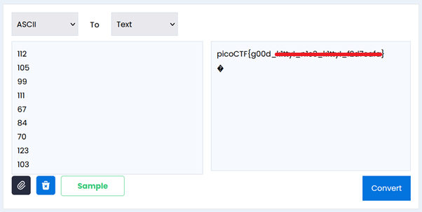

# Nice netcat...

**Platform:** picoCTF  
**Category:** General skills              
**Difficulty:** Easy  
**Tags:** `ASCII`

---

## Challenge Description

**Author:** syreal

**Description**

There is a nice program that you can talk to by using this command in a shell:

Additional details will be available after launching your challenge instance.
          
---

## Reconnaissance

Running the provided program causes the server to output a stream of numbers. These are likely ASCII decimal values representing characters.

--- 

## Solving the challenge

### 1. Decode the ASCII values

Use an online ASCII-to-text converter, or write a Python script to get the flag:

```python
text = ""

while True:
    user_input = input("Enter an ASCII value (or 'q' to quit): ")
    
    if user_input.lower() == 'q':
        break

    try:
        ascii_value = int(user_input)
        #convert ascii value to character and append to existing text
        text += chr(ascii_value)
    
    except ValueError:
        print("Please enter a valid ASCII value or 'q' to quit.")

print(text)
```



--- 

## Flag

```
picoCTF{g00d_xxxxxx_xxxx_xxxxxx_xxxxxxxx}
```
*(Flag redacted)*

---

## Key takeaways

| # | Lesson |
|---|--------|
| 1 | ASCII is a character encoding where each printable character maps to a decimal number (e.g. 112 = 'p', 105 = 'i', 99 = 'c', 111 = 'o') |
| 2 | `netcat` (`nc`) is a fundamental networking tool used to open raw TCP/UDP connections to a host and port |
| 3 | Python's built-in `chr()` function converts an integer to its corresponding ASCII character |
| 4 | When a server outputs numbers instead of text, always check ASCII, Unicode code points, or other common encodings before assuming something more complex |


---
*← [Back to General skills](../../) | [Back to picoCTF](../../../)*
