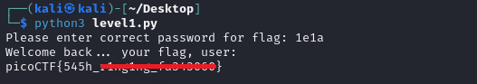

# PW Crack 1

**Platform:** picoCTF  
**Category:** General skills              
**Difficulty:** Easy  
**Tags:** `hash`

---

## Challenge Description

**Author:** LT 'syreal' Jones

**Description**

Can you crack the password to get the flag?

Download the password checker here and you'll need the encrypted flag in the same directory too.
          
---

## Reconnaissance

Inspecting `level1.py` reveals a hardcoded conditional: if the entered password matches a specific string (`1e1a`), the flag is printed.

```python
### THIS FUNCTION WILL NOT HELP YOU FIND THE FLAG --LT ########################
def str_xor(secret, key):
    #extend key to secret length
    new_key = key
    i = 0
    while len(new_key) < len(secret):
        new_key = new_key + key[i]
        i = (i + 1) % len(key)        
    return "".join([chr(ord(secret_c) ^ ord(new_key_c)) for (secret_c,new_key_c) in zip(secret,new_key)])
###############################################################################


flag_enc = open('level1.flag.txt.enc', 'rb').read()


def level_1_pw_check():
    user_pw = input("Please enter correct password for flag: ")
    if( user_pw == "1e1a"):
        print("Welcome back... your flag, user:")
        decryption = str_xor(flag_enc.decode(), user_pw)
        print(decryption)
        return
    print("That password is incorrect")


level_1_pw_check()
```

--- 

## Solving the challenge

### 1. Run the script and enter the password

```bash
python3 level1.py
```

Enter `1e1a` when prompted to receive the flag.



--- 

## Flag

```
picoCTF{545h_xxxxxxx_xxxxxxxx}
```
*(Flag redacted)*

---

## Key takeaways

| # | Lesson |
|---|--------|
| 1 | Hardcoding passwords directly in source code is a critical vulnerability. Anyone with access to the code immediately has the password |


---
*← [Back to General skills](../../) | [Back to picoCTF](../../../)*
