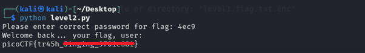

# PW Crack 2

**Platform:** picoCTF  
**Category:** General skills              
**Difficulty:** Easy  
**Tags:** `hash`

---

## Challenge Description

**Author:** LT 'syreal' Jones

**Description**

Can you crack the password to get the flag?

Download the password checker here and you'll need the encrypted flag in the same directory too.
          
---

## Reconnaissance

Inspecting `level2.py` reveals code that is similar to PW Crack 1, but the password is obfuscated using character codes. Decode them to find the password and retrieve the flag.

```python
### THIS FUNCTION WILL NOT HELP YOU FIND THE FLAG --LT ########################
def str_xor(secret, key):
    #extend key to secret length
    new_key = key
    i = 0
    while len(new_key) < len(secret):
        new_key = new_key + key[i]
        i = (i + 1) % len(key)        
    return "".join([chr(ord(secret_c) ^ ord(new_key_c)) for (secret_c,new_key_c) in zip(secret,new_key)])
###############################################################################

flag_enc = open('level2.flag.txt.enc', 'rb').read()


def level_2_pw_check():
    user_pw = input("Please enter correct password for flag: ")
    if( user_pw == chr(0x34) + chr(0x65) + chr(0x63) + chr(0x39) ):
        print("Welcome back... your flag, user:")
        decryption = str_xor(flag_enc.decode(), user_pw)
        print(decryption)
        return
    print("That password is incorrect")


level_2_pw_check()
```

--- 

## Solving the challenge

### 1. Decode the character codes

The lines of code that will give you the flag:

```python
if password == chr(0x34) + chr(0x65) + chr(0x63) + chr(0x39):
```
Convert each hex value to its ASCII character:

| Hex | Decimal | Character |
|-----|---------|-----------|
| `0x34` | 52 | `4` |
| `0x65` | 101 | `e` |
| `0x63` | 99 | `c` |
| `0x39` | 57 | `9` |

The password is: **`4ec9`**

You can verify this using CyberChef with the **"From Charcode"** operation (base 16), or a quick Python one-liner:

```python
print(chr(0x34) + chr(0x65) + chr(0x63) + chr(0x39))
# Output: 4ec9
```

---

### 2. Run the script and enter the password
```bash
python3 level2.py
```

Enter `4ec9` when prompted to receive the flag.



--- 

## Flag

```
picoCTF{tr45h_xxxxxxx_xxxxxxxx}
```
*(Flag redacted)*

---

## Key takeaways

| # | Lesson |
|---|--------|
| 1 | Encoding a password using `chr()` and hex values is obfuscation, not encryption, it takes seconds to reverse |
| 2 | Python's `chr()` converts an integer (decimal or hex) to its corresponding ASCII character; `ord()` does the reverse |
| 3 | CyberChef's "From Charcode" operation handles this kind of decoding without writing any code |


---
*← [Back to General skills](../../) | [Back to picoCTF](../../../)*
