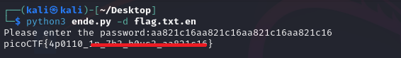

# Python Wrangling

**Platform:** picoCTF  
**Category:** General skills              
**Difficulty:** Easy  
**Tags:** `python`

---

## Challenge Description

**Author:** syreal

**Description**

Python scripts are invoked kind of like programs in the Terminal...

Can you run ende.py using password.txt to get flag.txt.en?

```python
import sys
import base64
from cryptography.fernet import Fernet


usage_msg = "Usage: "+ sys.argv[0] +" (-e/-d) [file]"
help_msg = usage_msg + "\n" +\
        "Examples:\n" +\
        "  To decrypt a file named 'pole.txt', do: " +\
        "'$ python "+ sys.argv[0] +" -d pole.txt'\n"


if len(sys.argv) < 2 or len(sys.argv) > 4:
    print(usage_msg)
    sys.exit(1)


if sys.argv[1] == "-e":
    if len(sys.argv) < 4:
        sim_sala_bim = input("Please enter the password:")
    else:
        sim_sala_bim = sys.argv[3]

    ssb_b64 = base64.b64encode(sim_sala_bim.encode())
    c = Fernet(ssb_b64)

    with open(sys.argv[2], "rb") as f:
        data = f.read()
        data_c = c.encrypt(data)
        sys.stdout.write(data_c.decode())


elif sys.argv[1] == "-d":
    if len(sys.argv) < 4:
        sim_sala_bim = input("Please enter the password:")
    else:
        sim_sala_bim = sys.argv[3]

    ssb_b64 = base64.b64encode(sim_sala_bim.encode())
    c = Fernet(ssb_b64)

    with open(sys.argv[2], "r") as f:
        data = f.read()
        data_c = c.decrypt(data.encode())
        sys.stdout.buffer.write(data_c)


elif sys.argv[1] == "-h" or sys.argv[1] == "--help":
    print(help_msg)
    sys.exit(1)


else:
    print("Unrecognized first argument: "+ sys.argv[1])
    print("Please use '-e', '-d', or '-h'.")
```


---

## Reconnaissance

Three files are provided: a Python script (`ende.py`), an encrypted flag file (`flag.txt.en`), and a password file (`password.txt`).

Reading the source code of `ende.py` reveals: `-e` runs encryption and `-d` runs decryption. Since the flag file is already encrypted (`.en` extension), decryption is required.

--- 

## Solving the challenge

### 1. Run the decryption command

```bash
python3 ende.py -d flag.txt.en
```

--- 

### 2. Enter the password

When prompted, paste in the contents of `password.txt`:

```bash
cat password.txt
```

Copy the string and enter it at the password prompt. The flag will be printed



--- 

## Flag

```
picoCTF{4p0110_xx_xxx_xxxxx_xxxxxxxx}
```
*(Flag redacted)*

---

## Key takeaways

| # | Lesson |
|---|--------|
| 1 | Always read the source code of a provided script before running it. Argument flags and usage instructions are often documented in the code itself |
| 2 | Encrypted files paired with a separate password file are a common CTF pattern; the password file is always worth reading first |
| 3 | Python scripts frequently use `argparse` or `sys.argv` to handle command-line arguments — understanding `-e`/`-d` style flags is essential for working with such programs |
| 4 | Symmetric encryption (where the same password encrypts and decrypts) is common in CTFs |


---
*← [Back to General skills](../../) | [Back to picoCTF](../../../)*
