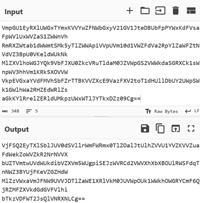
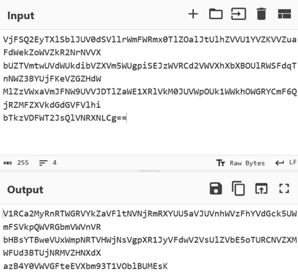
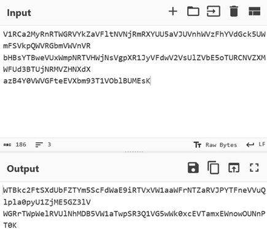
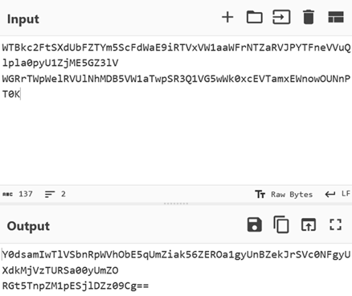
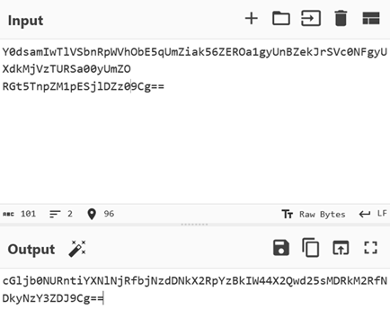
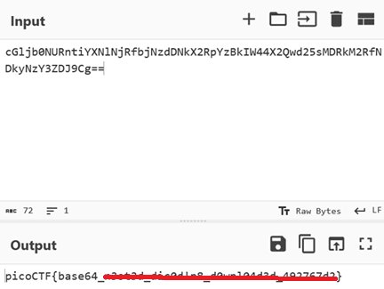
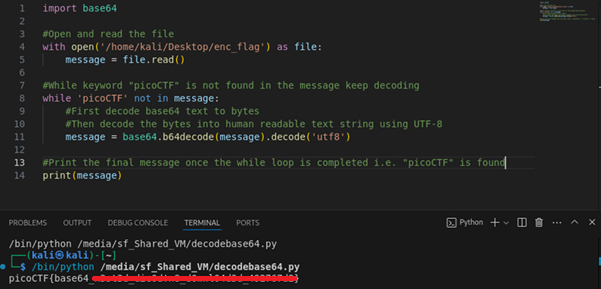

# repetitions

**Platform:** picoCTF  
**Category:** General skills              
**Difficulty:** Easy  
**Tags:** `Base64`

---

## Challenge Description

**Author:** Theoneste Byagutangaza

**Description**

Can you make sense of this file?

Download the file here.
          
---

## Reconnaissance

Opening `enc_flag` in a text editor reveals a string ending in `==`, which is a strong indicator of Base64 encoding. The title "Repetitions" hints that the encoding has been applied multiple times.

--- 

## Solving the challenge

There are two methods that could be used to solve this challenge:
1. Manual decoding using Cyberchef
2. Python script (automated)

### Method 1: Manual decoding with CyberChef

1. Open [CyberChef](https://gchq.github.io/CyberChef/)
2. Paste the encoded string
3. Apply the **"From Base64"** operation
4. Take the output and apply **"From Base64"** again
5. Repeat until the output reads `picoCTF{...}`

The flag will appear after 6rounds of decoding.








---

### Method 2: Python script (automated)

```python
import base64

#Open and read the file 
with open('/home/kali/Desktop/enc_flag') as file:
    message = file.read()

#While keyword "picoCTF" is not found in the message keep decoding
while 'picoCTF' not in message:
    #First decode base64 text to bytes
    #Then decode the bytes into human readable text string using UTF-8
    message = base64.b64decode(message).decode('utf-8')

#Print the final message once the while loop is completed i.e. "picoCTF" is found
print(message)
```

Run the script and it will keep decoding until the `picoCTF` keyword appears in the output.



--- 

## Flag

```
picoCTF{base64_xxxxxx_xxxxxxxx_xxxxxxxxxx_xxxxxxxx}
```
*(Flag redacted)*

---

## Key takeaways

| # | Lesson |
|---|--------|
| 1 | Base64 strings are recognisable by their character set (`A–Z`, `a–z`, `0–9`, `+`, `/`) and padding `==` or `=` at the end |
| 2 | Base64 converts binary data into plain ASCII text so it can be safely transmitted over text-only systems such as email, URLs, and JSON |
| 3 | Layering encoding is **not** encryption. It provides zero confidentiality since any decoder can reverse it without a key |
| 4 | Automating repetitive decoding tasks with a simple loop is far more efficient than doing it manually round by round |


---
*← [Back to General skills](../../) | [Back to picoCTF](../../../)*
