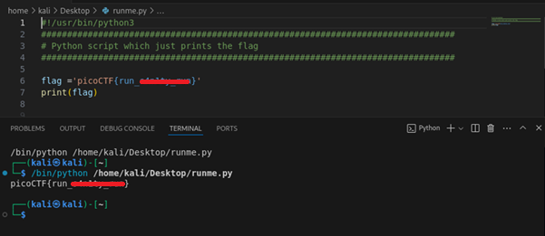

# runme.py

**Platform:** picoCTF  
**Category:** General skills              
**Difficulty:** Easy  
**Tags:** `python`

---

## Challenge Description

**Author:** Sujeet Kumar

**Description**

Run the runme.py script to get the flag. Download the script with your browser or with wget in the webshell.

Download runme.py Python script
          
---

## Reconnaissance

Download the Python script and run it to get the flag.

--- 

## Solving the challenge

### 1. Run the script

```bash
python3 runme.py
```

The flag is printed directly to the terminal.



--- 

## Flag

```
picoCTF{run_xxxxxx_xxx}
```
*(Flag redacted)*

---

## Key takeaways

| # | Lesson |
|---|--------|
|---|--------|
| 1 | Always inspect a script before running it (especially in real-world scenarios), but in a safe CTF environment, running it directly is acceptable |


---
*← [Back to General skills](../../) | [Back to picoCTF](../../../)*
