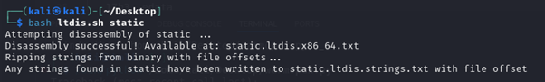

# Static ain't always noise

**Platform:** picoCTF  
**Category:** General skills              
**Difficulty:** Easy  
**Tags:** `binary` `objdump` `chmod` `bash`

---

## Challenge Description

**Author:** syreal

**Description**

Can you look at the data in this binary? The bash script might help!

static, ltdis.sh

```bash
#!/bin/bash


echo "Attempting disassembly of $1 ..."


#This usage of "objdump" disassembles all (-D) of the first file given by 
#invoker, but only prints out the ".text" section (-j .text) (only section
#that matters in almost any compiled program...

objdump -Dj .text $1 > $1.ltdis.x86_64.txt


#Check that $1.ltdis.x86_64.txt is non-empty
#Continue if it is, otherwise print error and eject

if [ -s "$1.ltdis.x86_64.txt" ]
then
	echo "Disassembly successful! Available at: $1.ltdis.x86_64.txt"

	echo "Ripping strings from binary with file offsets..."
	strings -a -t x $1 > $1.ltdis.strings.txt
	echo "Any strings found in $1 have been written to $1.ltdis.strings.txt with file offset"


else
	echo "Disassembly failed!"
	echo "Usage: ltdis.sh <program-file>"
	echo "Bye!"
fi
```

---

## Reconnaissance

A binary file and a shell script (`ltdis.sh`) are provided. Use the script to analyse the binary and find the flag.

Inspecting `ltdis.sh` reveals two key lines. First, `$1` is used as a placeholder for the binary filename passed as an argument. Second, `objdump` is called with `-D` (disassemble all sections) and `-j .text` (focus on the text/code section), and the output is written to a `.txt` file.

--- 

## Solving the challenge

### 1. Read the script source

The script uses `$1` as the filename argument and calls `objdump` to disassemble the binary, writing the result to disk.

--- 

### 2. Make the script executable

```bash
chmod +x ltdis.sh
```

--- 

### 3. Run the script against the binary

```bash
bash ltdis.sh static
```



--- 

### 4. Inspect the output files

Three files are created. Open each one and search for the flag string:

```bash
grep -i 'pico' static.ltdis.strings.txt
```

The flag will appear in one of the output files.


--- 

## Flag

```
picoCTF{l3v3l_xxx_xxxx_x_xxxxx_xxxxxxxx}
```
*(Flag redacted)*

---

## Key takeaways

| # | Lesson |
|---|--------|
| 1 | Tab completion in the terminal is a powerful navigation tool, by pressing `Tab` it autocompletes filenames and directory names, saving significant time |
| 2 | When faced with deeply nested structures, always look for a shortcut (shell completion, `find`, `ls -R`) rather than navigating manually |
| 3 | `find . -type f` is another way to locate a file buried in nested directories without navigating each folder by hand |


---
*← [Back to General skills](../../) | [Back to picoCTF](../../../)*
