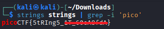

# Strings it

**Platform:** picoCTF  
**Category:** General skills              
**Difficulty:** Easy  
**Tags:** `binary` `strings` `chmod`

---

## Challenge Description

**Author:** Sanjay C/Danny Tunitis

**Description**

Can you find the flag in file without running it?

---

## Reconnaissance

Binary files often contain embedded plaintext strings including configuration data, error messages, or, in this case, a flag. The `strings` command extracts all human-readable sequences from a binary.

--- 

## Solving the challenge

### 1. Use the strings command

```bash
strings <binaryfile> | grep -i 'pico'
```

The flag will appear in the output.



--- 

## Flag

```
picoCTF{5tRIng5_xx_xxxxxxxx}
```
*(Flag redacted)*

---

> **Alternative approaches:**

A Python script (as that used in challenge: Wave a flag) that opens the binary in `rb` mode and prints its contents can also reveal the flag. Use `Shift + Ctrl + F` in your editor to search for `pico` across all open files.


```python
file = open("strings", "rb")

binaryf = file.read()
print(binaryf)

file.close()
```

OR

Use `ltdis.sh` from the challenge "Static ain't always noise", make it executable and run it:

```bash
chmod +x ltdis.sh
bash ltdis.sh strings
```

Then search the output text files:

```bash
grep -i 'pico' strings.ltdis.strings.txt
```

## Key takeaways

| # | Lesson |
|---|--------|
| 1 | The `strings` command extracts all printable character sequences of 4 or more characters from a binary. It is the fastest first step in binary analysis |
| 2 | Piping `strings` output into `grep` narrows results instantly: `strings binary \| grep -i 'pico'` |
| 3 | Flags and secrets embedded in binaries as plaintext strings are a very common vulnerability in real software, not just CTFs |
| 4 | Both `strings + grep` and `ltdis.sh` (objdump-based) are valid approaches |


---
*← [Back to General skills](../../) | [Back to picoCTF](../../../)*
