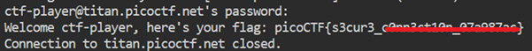

# Super SSH

**Platform:** picoCTF  
**Category:** General skills                           
**Difficulty:** Easy  
**Tags:** `ssh`

---

## Challenge Description

**Author:** Jeffery John

**Description**

Using a Secure Shell (SSH) is going to be pretty important.

Additional details will be available after launching your challenge instance.

---

## Reconnaissance

The challenge provides a hostname (`titan.picoctf.net`), a port (`60300`), a username (`ctf-player`), and a password.


--- 

## Solving the challenge

### 1. Connect to the remote server using SSH

Run the following command to establish an SSH connection on the non-default port:

```bash
ssh ctf-player@titan.picoctf.net -p 60300
```

Enter the provided password when prompted. The flag is printed to the terminal immediately after login.



--- 

## Flag

```
picoCTF{s3cur3_xxxxxxxxxx_xxxxxxxx}
```
*(Flag redacted)*

---

## Key takeaways

| # | Lesson |
|---|--------|
| 1 | **SSH (Secure Shell)** creates an encrypted connection to a remote host; `-p` specifies a non-standard port when the server is not listening on the default port 22 |
| 2 | The syntax `ssh <user>@<host> -p <port>` is a fundamental command used in both CTF and real-world system administration |
| 3 | Once connected, the user inherits the permissions of the account they logged in as and can navigate the remote filesystem within those permissions |
| 4 | Weak or shared passwords on SSH servers are a real-world vulnerability. In production, key-based authentication should be used instead |


---
*← [Back to General skills](../../) | [Back to picoCTF](../../../)*
