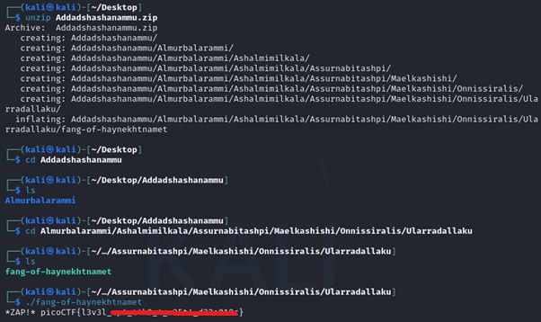

# Tab, Tab, Attack

**Platform:** picoCTF  
**Category:** General skills              
**Difficulty:** Easy  
**Tags:** `linux`

---

## Challenge Description

**Author:** syreal

**Description**

Using tabcomplete in the Terminal will add years to your life, esp. when dealing with long rambling directory structures and filenames.

Addadshashanammu.zip
          
---

## Reconnaissance

Download a zip file containing deeply nested folders. Navigate through them to find the flag hidden at the bottom of the directory tree.

The challenge name: *Tab Tab Attack*, is a direct clue. In most terminals, pressing `Tab` autocompletes a path or filename. Pressing it again moves to the next match. Manually `cd`-ing into each folder one by one would take far too long.

--- 

## Solving the challenge

### 1. Use Tab to navigate quickly

Instead of typing each folder name in full, type `cd ` followed by the first few characters of the folder name, then press `Tab` to autocomplete. Press `Tab` again to descend into the next folder. Keep repeating until the terminal can no longer autocomplete further.

```bash
cd <start of folder name><Tab><Tab><Tab>...
```

This rapidly traverses the entire nested structure.

--- 

### 2. Find and read the flag file

```bash
ls
```

A file will be present. Run it to retrieve the flag:

```bash
./fang-of-haynekhtnamet
```



--- 

## Flag

```
picoCTF{l3v3l_xxx_xxxx_x_xxxxx_xxxxxxxx}
```
*(Flag redacted)*

---

## Key takeaways

| # | Lesson |
|---|--------|
| 1 | Tab completion in the terminal is a powerful navigation tool, by pressing `Tab` it autocompletes filenames and directory names, saving significant time |
| 2 | When faced with deeply nested structures, always look for a shortcut (shell completion, `find`, `ls -R`) rather than navigating manually |
| 3 | `find . -type f` is another way to locate a file buried in nested directories without navigating each folder by hand |


---
*← [Back to General skills](../../) | [Back to picoCTF](../../../)*
