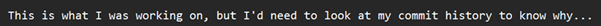
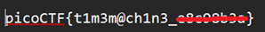

# Time Machine

**Platform:** picoCTF  
**Category:** General skills                           
**Difficulty:** Easy  
**Tags:** `git` `COMMIT_EDITMSG`

---

## Challenge Description

**Author:** Jeffery John

**Description**

What was I last working on? I remember writing a note to help me remember...

You can download the challenge files here:

    challenge.zip

---

## Reconnaissance

Extracting `challenge.zip` reveals a project directory containing `message.txt` and a `.git` folder. Opening `message.txt` shows the following message:



The presence of `.git` means the full commit history is available.


--- 

## Solving the challenge

### 1. Inspect COMMIT_EDITMSG

Inspect the Git metadata file `COMMIT_EDITMSG`, which stores the message of the most recent commit:

```bash
cat .git/COMMIT_EDITMSG
```

The commit message contains the flag directly.



--- 

## Flag

```
picoCTF{t1m3m@ch1n3_xxxxxxxx}
```
*(Flag redacted)*

---

## Key takeaways

| # | Lesson |
|---|--------|
| 1 | When a Git repository (`.git` folder) is present, the **entire project history** is available locally, including commits, messages, and past file contents |
| 2 | `.git/COMMIT_EDITMSG` stores the last commit message and is a quick first place to check for information disclosure |
| 3 | Version control systems can leak sensitive information; `.git` folders should never be exposed on public web servers |
| 4 | Even if a secret is removed from the latest commit, it may still exist in earlier commits and be recoverable with `git log` and `git show` |


---
*← [Back to General skills](../../) | [Back to picoCTF](../../../)*
