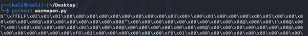
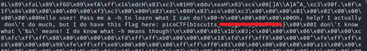

# Wave a flag

**Platform:** picoCTF  
**Category:** General skills              
**Difficulty:** Easy  
**Tags:** `binary file`

---

## Challenge Description

**Author:** syreal

**Description**

Can you invoke help flags for a tool or binary? This program has extraordinarily helpful information...

warm
          
---

## Reconnaissance

Attempting to open the file normally produces an error because it is a binary file and cannot be read as plain text by a standard editor.

--- 

## Solving the challenge

### 1. Write a Python program to read the binary

```python
file = open("warm", "rb")

binaryf = file.read()
print(binaryf)

file.close()
```

--- 

### 2. Run the program

```bash
python3 read_binary.py
```



---

### 3. Locate the flag

Scroll through the output. The flag string (beginning with `picoCTF{`) will appear embedded in the binary data.



--- 

## Flag

```
picoCTF{b1scu1ts_xxx_xxxxx_xxxxxxxx}
```
*(Flag redacted)*

---

## Key takeaways

| # | Lesson |
|---|--------|
| 1 | Binary files can contain readable strings (ASCII or UTF-8) embedded within them. These are often passwords, flags, or configuration values |
| 2 | Opening a binary in `rb` (read binary) mode in Python gives access to all bytes, including any embedded plaintext |
| 3 | The `strings` command-line tool is an even faster way to extract human-readable text from a binary: `strings filename \| grep pico` |


---
*← [Back to General skills](../../) | [Back to picoCTF](../../../)*
