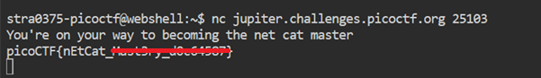

# What's a net cat?

**Platform:** picoCTF  
**Category:** General skills              
**Difficulty:** Easy  
**Tags:** `netcat` 

---

## Challenge Description

**Author:** Sanjay C/Danny Tunitis

**Description**

Using netcat (nc) is going to be pretty important. Can you connect to jupiter.challenges.picoctf.org at port 25103 to get the flag?

---

## Reconnaissance

The challenge provides a hostname and port. Netcat (`nc`) is used to open a direct TCP connection to the server, which will return the flag.

--- 

## Solving the challenge

### 1. Connect using netcat**

```bash
nc jupiter.challenges.picoctf.org 25103
```

The server will respond with the flag immediately upon connection.



--- 

## Flag

```
picoCTF{nEtCaT_xxxxxxx_xxxxxxxx}
```
*(Flag redacted)*

---


## Key takeaways

| # | Lesson |
|---|--------|
| 1 | `nc <host> <port>` opens a raw TCP connection to a server. It is the most direct way to interact with a challenge service |
| 2 | Netcat is called the "Swiss Army knife of networking" and is used in CTFs, penetration testing, and debugging network services |
| 3 | Some servers send data immediately on connection; others wait for input |


---
*← [Back to General skills](../../) | [Back to picoCTF](../../../)*
